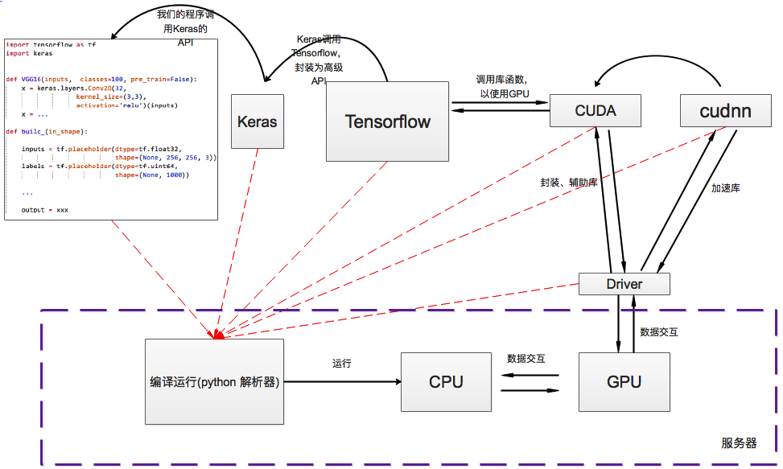
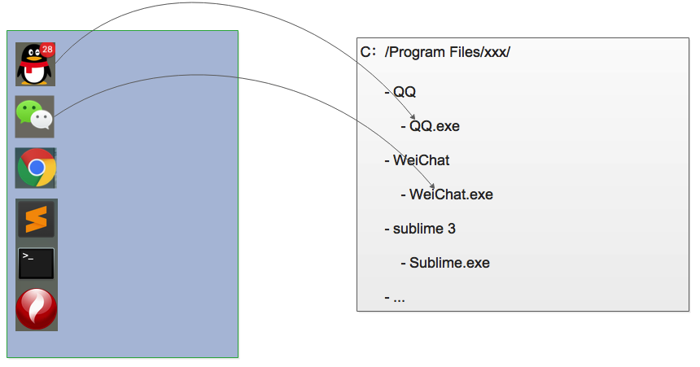
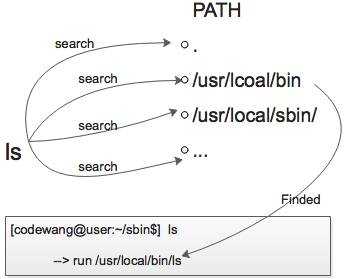
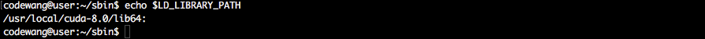
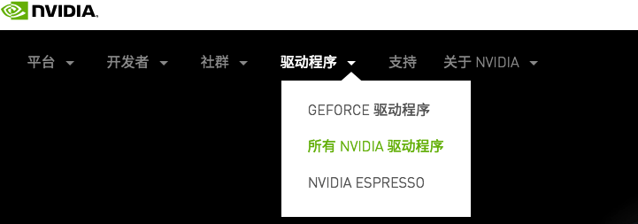
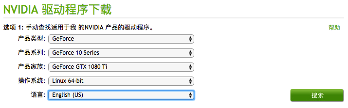
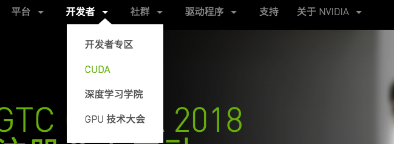
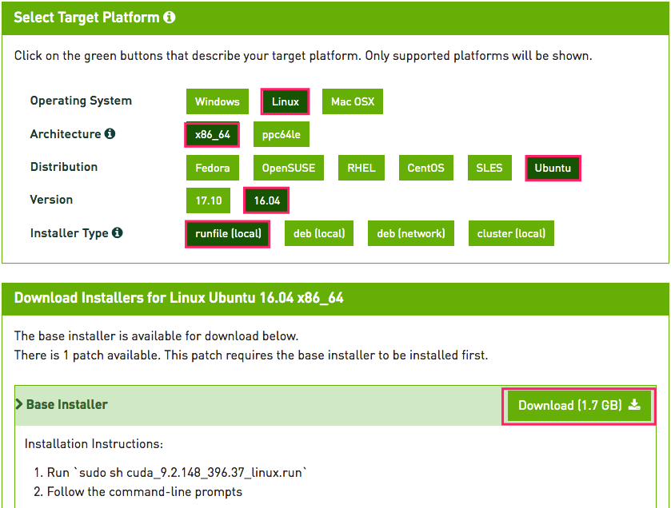
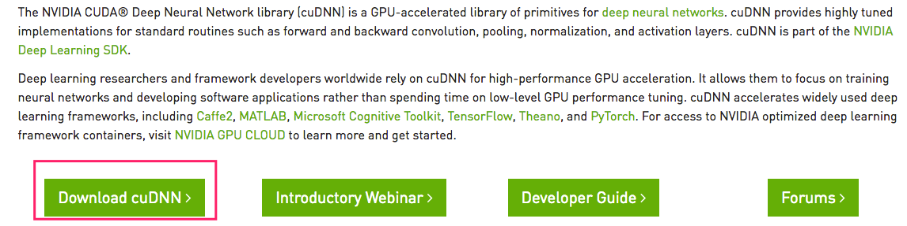
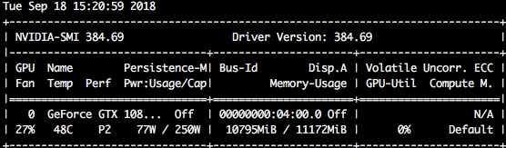

# CBIB Ubuntu Server Manual

| version | author | date       | diff  | other          |
| ------- | ------ | ---------- | ----- | -------------- |
| V1.0    | 王彬   | 2018.09.06 | Setup | initialization |

---

[TOC]

## 前言

       此指导书作为CBIB实验室公用Ubuntu服务器指导资料，包含但不局限于深度学习环境搭建、服务器运维、服务器日常维修、硬件维护、问题定位以及解决措施，仅供参考。**除此之外还配备常见FAQ**，见[README.md](./README.md)。希望以此传承下去，为后续师兄弟减少环境搭建工作量，节约学习时间。

**请历届管理员严格把守以下规则：**

-  服务其ip地址不得以任何形式对外泄露
- 不得将服务器账号租、借给实验室意外人员
- 不使用GPU（仅占用CPU）的项目不得使用服务器
- 实验室老成员毕业离校后，及时回收账号
- 同一项目同一程序一次不得使用超过4块GPU，特殊情况除外
- 任何人不得私自删除、升级**公用库**（cuda、cudnn、tensorflow、keras、pytorch、caffa等），需经过管理员和大家一致同意后方可升级
- 普通用户（非管路员）不得修改`/etc/profile`、`/etc/bashrc`等公共配置文件
- 每人限制一个服务器账号，不使用远程桌面（或使用频率低于2次/天）的用户，远程桌面应该处于常关状态
- 除管理员和负责人(金人超老师)以外，任何人不得使用root登录，root密码不得向任何人泄露
- 服务器机房每天必须检查一次，确保空调处于开启状态，室内温度不得超过40度
- 每隔一段时间要检查服务器机架后侧电线，防止温度过高造成电线老化漏电

----

此项目自2018.9.6发起，手册开源于github，由每一届服务器运维管理员负责维护。

> 2017.9~2018.9   管理员codewang， github地址<https://github.com/codewanghust/CBIB_Server_Manual>

---


## 第一章  服务器介绍

      **Note：**后文中Linux发行版特指Ubuntu.本手册只提供命令行操作指导，不提供图像界面操作指导。

### 1.1 硬件

       实验室目前共2台大服务器（10-GPU），2台小服务器（2-GPU）。其硬件配置如表1-1所示。

| 服务器编号 |   俗名    | GPU数量 |       GPU型号       | 显存 | 内存  | 硬盘 |                           CPU型号                            | 负责人 |
| :--------: | :-------: | :-----: | :-----------------: | :--: | :---: | :--: | :----------------------------------------------------------: | :----: |
|     1      | 老服务器  |   10    | GeForce GTX 1080 Ti | 12GB | 128GB | 12TB | `Intel(R) Xeon(R) CPU E5-2683 v3 @ 2.00GHz（2CPU-28核-64bit）` | 曹海潮 |
|     2      | 新服务器  |   10    | GeForce GTX 1080 Ti | 12GB | 128GB | 4TB  | `Intel(R) Xeon(R) CPU E5-2683 v3 @ 2.00GHz（2CPU-28核-64bit）` |  王彬  |
|     3      | 小服务器1 |    2    | GeForce GTX 1080 Ti | 12GB | 64GB  | 2TB  | `Intel(R) Xeon(R) CPU E5-2603 v4 @ 1.70GHz (1GPU-6核-64bit)` |  王彬  |
|     4      | 小服务器2 |         | GeForce GTX 1080 Ti | 12GB | 64GB  | 2TB  | `Intel(R) Xeon(R) CPU E5-2603 v4 @ 1.70GHz (1GPU-6核-64bit)` | 陆建国 |

<center> 表1-1 服务器硬件配置表 </center>

其中：

- 1号**老服务器**位于机房-服务器机架从上往下第一台（无外接显示器，无键鼠，与2号公用）
- 2号**新服务器**位于机房-服务器机架从上往下第二台（有外接显示器，有键鼠）
- 3号**小服务器1**位于实验室-进门第4排-右数4号桌（有外接显示器，有键鼠）
- 4号**小服务器2**位于机房-进门空调旁边（无外接显示器，无键鼠）

### 1.2 软件

        软件配置涉及到大家的深度学习平台，格外重要。请管理员及时维护此表（表1-2），一旦出现私自更新、删除公用库可按照此表进行恢复。**这里只统计公用数据库，公用库，公用应用程序, \*表示未统计项，或不重要**

|     软件名称     |           1号            |           2号            |                3号                |                 4号                 | 表项维护人@维护日期 |
| :--------------: | :----------------------: | :----------------------: | :-------------------------------: | :---------------------------------: | :-----------------: |
|       `OS`       | `Ubuntu LTS 14.04(出厂)` | `Ubuntu LTS 14.04(出厂)` | `Ubuntu LTS 16.04  (王彬@2018.6)` | `Ubuntu LTS 16.04（陆建国@2018.6）` | `codewang@2018.9.6` |
|      `CUDA`      |          `9.0`           |          `8.0`           |               `9.0`               |                `9.0`                | `codewang@2018.9.6` |
|     `cudnn`      |           `*`            |           `*`            |               `8.5`               |                 `*`                 | `codewang@2018.9.6` |
| `nvidia-driver`  |        `384.130`         |         `384.69`         |             `384.130`             |                 `*`                 | `codewang@2018.9.6` |
|    `python3`     |         `3.4.3`          |         `3.4.3`          |              `3.6.5`              |                 `*`                 | `codewang@2018.9.6` |
| `Tensorflow`-gpu |         `1.3.0`          |         `1.4.0`          |              `1.8.0`              |                 `*`                 | `codewang@2018.9.6` |
|  `Tensorboard`   |         `0.1.8`          |         `0.4.0`          |              `1.8.0`              |                 `*`                 | `codewang@2018.9.6` |
|     `Keras`      |         `2.0.8`          |         `2.1.6`          |              `2.2.0`              |                 `*`                 | `codewang@2018.9.6` |
|    `Pytorch`     |           `无`           |         `0.1.0`          |                `*`                |                 `*`                 | `codewang@2018.9.6` |
|     `Caffa`      |           `*`            |           `*`            |               `无`                |                 `*`                 | `codewang@2018.9.6` |
|     `Theano`     |           `*`            |         `1.0.2`          |               `无`                |                 `*`                 | `codewang@2018.9.6` |
|     `Mxnet`      |           `*`            |      `1.1.0.post0`       |               `无`                |                 `*`                 | `codewang@2018.9.6` |
|    `xgboost`     |         `0.6a2`          |          `0.71`          |               `无`                |                 `*`                 | `codewang@2018.9.6` |
|    `ipython`     |         `6.2.1`          |         `6.2.1`          |              `6.4.0`              |                 `*`                 | `codewang@2018.9.6` |
|     `Cython`     |         `0.27.3`         |         `0.27.3`         |             `0.28.2`              |                 `*`                 | `codewang@2018.9.6` |

<center> 表1-2 服务器软件配置表 </center>

### 1.3 IP地址

IP地址是向学校申请的固定IP地址，如表1-3所示，校内任何地方均可以访问。**切记不可将服务IP地址告诉他人。**

| 编号 |     IP地址      |
| :--: | :-------------: |
| 1号  | xxx.xxx.xxx.253 |
| 2号  | xxx.xxx.xxx.232 |
| 3号  | xxx.xxx.xxx.226 |
| 4号  | xxx.xxx.xxx.225 |

<center> 表1-3 服务器IP配置表 </center> 

---


## 第二章 服务器配置

本章内容包括：

- 如何安装cuda、cudnn、tensorflow-gpu等深度学习框架，以及其配置过程
- 常用软件安装配置
- 固定IP配置
- 远程桌面配置<需配合第三章 Linux运维，可先阅读第三章>

### 2.1 深度学习框架配置

       由于实验室项目不尽相同，不同的项目组可能会使用不同的深度学习框架，管理员只需用维护tensorflow和keras即可。但是cuda、cudnn是所有框架公用的，所以升级和维护需要实现与各项目组沟通协调。目前实验室所使用的深度学习框架包括：`keras with tensorflow-backend`(刘老师、马老师项目组)、`caffa`（金老师项目组）、`matlab`（许老师项目组）、`other`，下面主要介绍cudnn、cuda以及tensorflow和keras的安装配置。

#### 2.1.1 深度学习库依赖关系

       我们知道CPU也好、GPU也好、硬盘、内存都是物理设备都属于硬件，那么操作系统或者计算机软件想要使用这些硬件，就需要驱动程序，这和Window是一样的。（虽然windows上有许多设备是免驱的，但是实质上他们使用的是公用驱动，万能驱动。比如鼠标、蓝牙键盘等，其实他们都是使用默认的USB设备驱动程序，所以可以免驱），所以我们想要使用GPU首先需要安装**驱动程序**。

       除此之外，tensorflow这样的深度学习框架也不可能直接和GPU驱动程序打交道，不然tensorflow的软件体量就太大了，所以NVIDIA公司为这些上层应用软件提供了一些辅助程序，称之为**cuda**和**cudnn**。

       然后就是我们熟悉的深度学习框架了，比如tensorflow、pytorch、mxnet、caffa等,**注意，Keras严格意义上来说并不是深度学习框架，它是以tensorflow或者theaon后后端的高级封装API库。**下面我们用一副图来了解它们的关系。如图2-1所示：



<center>图2-1 深度学习库依赖关系</center>

#### 2.1.2 Linux加载库过程简介

        本节，我将通过类比windows应用程序来解释Linux系统是如果启动应用程序，如何加载动态链接库的。假设我们在windows上安装一个QQ软件，其步骤如下：

- 下载QQ安装包，一般为`.exe`
- 安装
  - 选择安装位置，默认为`C:/Program files/xxx`
  - 创建桌面快捷方式
  - 安装完成
- 启动应用程序

实质上我们选择安装路径时，安装程序会将QQ安装包的内容，所需要的库文件，数据库等拷贝到我们指定的目录下，同时还会设置注册表（这个不清楚没关系）。然后创建桌面快捷方式比如`/Desktop/QQ`,当我们点击运行`QQ(快捷方式)`时系统会找到此快捷方式所指定的应用程序，也就是`C:/Program Files/xxx/QQ.exe`,然后就完成启动了。



Linux下的程序启动与Window类似，但也有些不同，首先linux不存在快捷方式，那么问题就来,linux是如何找到对应的应用程序的呢？

> Linux下启动应用程序，系统会根据环境变量 **PATH** 指定的路径，取对应的路径下查找应用程序。
>
> 我们可以使用echo命令查看环境变量：
>
> `echo $PATH`    `<--- $ 表示读取环境变量， echo是输出显示命令`
>
> (2号服务器)输出为：
>
> `/usr/local/MATLAB/R2014b/bin:/usr/local/cuda-8.0/bin:/usr/local/sbin:/usr/local/bin:/usr/sbin:/usr/bin:/sbin:/bin:/usr/games:/usr/local/games:/usr/lib/jvm/java-8-oracle/bin:/usr/lib/jvm/java-8-oracle/db/bin:/usr/lib/jvm/java-8-oracle/jre/bin`
>
> ---------
>
> 我们可以看到PATH环境变量中有很多路径，用 **: (冒号)**隔开，那么假设当我们在终端键入 `ls`命令时，实质上Linux系统会去这些路径下查找名称为`ls`的应用程序（默认优先查找当前路径`.`），最终会在`usr/local/bin/`找到`ls`程序，然后调用它，所以说我们运行`ls`其实是运行`/usr/local/bin/ls`.



那么同样的道理，如果程序需要加载某个动态链接库，那么它会去哪些路径下查找呢？答案是**LD_LIBRARY_PATH**




#### 2.1.3 Linux环境变量的配置

上面我们讲了Linux运行应用程序和加载动态链接库时所依赖的两个环境变量，下面我们讲解如何设置环境变量，每个用户的环境变量有什么区别?

首先我要强调一点，**Linux系统不是桌面系统，其设计之初就不是为日常办公而设计，它是一种多用户的服务器型的操作系统**，既然Linux是多用的操作系统，那么问题就随之而来，假如某台服务器上有AB两个用户，A用户安装了一个QQ轻量版并且设置了`PATH`环境变量，B用户又想使用完整版的QQ，于是他也下载安装了完整版的QQ，也设置了环境变量`PATH`， 那么这就造成的冲突。因此**Linux中每个用户的环境变量都是独立的！**

**a) 如何设置环境变量  ---> export**

Linux中我们使用`export`命令来设置环境变量，但是要主要环境变量有它自己的生命周期。设置的环境变量有效期直至当机器**重新启动**或者该环境变量被**覆盖**、被**删除**时。我们可以再命令行中使用`export`命令来设置环境变量，下面我们看一个例子：

``` shell
[codewang$] echo $HELLO_WORLD    --> 查看环境变量 `HELLO_WORLD`
                                 --> 该用户的该环境变量不存在，或者为空 
[codewang$] export HELLO_WORLD='never fight alone'   --> 定义环境变量
[codewang$] echo $HELLO_WORLD
never fight alone    --> 可以看到已经设置成功
  
[codewang$] logout   --> 退出登录
----------------------------------------------------------------
我们切换登录另一个用户 user
[user$] echo $HELLO_WORLD   --> 查看环境变量 `HELLO_WORLD`
                            --> 不存在，这也说明了用户的环境变量是独立的。
[user$]  
```

**b) 脚本设置环境变量  --> /home/username/.bashrc**

上面介绍了使用`export`来设置环境变量，但是也面临着一个问题，一旦机器重启那我们就得重新设置环境变量，这岂不是很麻烦，好在Linux系统在启动时会自动运行一些脚本(有兴趣的同学可以查阅相应资料)，在系统启动、或者用户登录时系统自动运行该用户`home`下的`.bashrc`脚本（shell 脚本）。所以每个用户都可以自己定制自己的启动脚本，那么我们就可以在该脚本中设置环境变量，就不用再操心系统重新的问题了。

``` shell
[codewang$] vim ~/.bashrc   --> ~的意思是当前用户的home目录，等价于/home/codewang
 
 -+-+-+-+-+-+-+-+ 以下为 /home/codewang/.bashrc 文件的内容 -+-+-+-+-+-+-+-+
 export PATH=xxx
 export LD_LIBRARY_PATH=xxx
 export HELLO_WORLD=xxx


 关于vim的使用，读者自行查阅资料。
 -+-+-+-+-+-+-+-+-+-+-+-+-+-+-+-+-+-+-+-+-+-+-+-+-+-+-+-+-+-+-+-+-+-+-+-+
```

**Note：**当我们编辑保存该脚本后，它要在系统重新或者用户登录时才会被调用，如果你编辑了该文件想立即生效那么我们可以运行`source`命令：`[codewang$] source ~/.bashrc`

**C) 通用环境变量配置 --> /etc/profile**

服务器上有很多大家公用的软件，公用的库文件，难道每个用户都要自己去一一配置环境变量吗？一旦某个库更新了，管理员要一个用户一个用户的取修改他们的`.bashrc`文件吗？这当然是不能忍受的。Linux在启动时还会调用一个脚本文件`/etc/profile`,它和每个用户目录下的`.bashrc`类似，区别在于**它设置的环境变量对所有用户有效！！！并且先于每个用户的.bashrc运行**

- 对所有用户有效

  我们可以很方便的为所有用户设置公共软件路径，公共库路径，例如tensorflow、cuda等公共库，管理员就可以设置`/etc/profile`来为所有用户设置`PATH和LD_LIBRARY_PATH`环境变量

- 先于每个用户的`.bashrc`运行

  这也说明了，如果`profile`中为每个用户设定了`PATH`,而某个用户自己的`.bashrc`也设置了`PATH`环境变量，那么**后者会覆盖前者**。

好了，设置环境变量就介绍这么多，其实linux设置环境变量的方式不止以上几种，但是我们常用的就是上面的方式，有兴趣的同学可以自行查阅相关资料。下面我们通过实例说明该如何**有效**的设置环境变量.

> 让我们先做以下假设：
>
> - 管理员在 `/usr/local/cuda`下安装了`cuda8.0`, 其中cdua的应用程序在`bin`目录下，库文件在`lib64`目录下。
> - `codewang`觉得`cuda8.0`太老旧了，自己想使用`cuda9.0`,并下载安装了`cuda9.0`安装在了`/usr/local/cuda-9.0`下面，同样的应用程序在`bin`目录下，库文件在`lib64`目录下。
>
> **管理员**
>
> 作为管理员，只要用户不破坏公共库，公共资源，原则上用户有使用任何版本的软件的自由，所以管理员
>
> 只能操作`/etc/profile`文件，不可擅自改动某个用户的`/home/username/.bashrc`文件,普通用户也不可以擅自修改`/etc/profile`文件。
>
> ``` shell
> ----- 以下为标准的/etc/profile文件配置 -----
> 
> # modified by codewang @2018.09.07     --> 修改文件添加备注，这是管理员的责任
> export PATH=$PATH:/usr/local/cuda/bin  
> export LD_LIBRARY_PATH=$LD_LIBRARY_PATH:/usr/local/cuda/lib64
> 
> # 解释
> # export PATH=$PATH:/usr/local/cuda/bin  
> # 首先PATH=$PATH  也就是等于原内容，然后后面追加内容，我们之前讲过多个路径用冒号隔开
> # 因此该命令的含义为：给PATH后面追加:/usr/local/cuda/bin
> # 这样就不会覆盖原来的环境变量了
> ```
>
> **codewang**
>
> 上面管理员为所有用户配置了`PATH和LD_LIBRARY_PATH`,但是我不想用`cuda8.0`，所以我可以通过设置我自己的环境变量来实现，同时还不影响其他用户。因此我只需用设置我自己的`.bashrc`文件即可。
>
> ``` shell
> ----- 以下为 codewang 的个人定制 ~/.bashrc 文件内容 -----
> 
> export PATH=$PATH:/usr/local/cuda-9.0/bin  
> export LD_LIBRARY_PATH=$LD_LIBRARY_PATH:/usr/local/cuda-9.0/lib64
> 
> # 解释
> # 管理员设置了两个环境变量，我又在后面追加我自己想用的cuda9.0
> # 这样，我的环境变量就包含了cuda8.0和cuda9.0， tensorflow依赖
> # 哪个版本它会自己查找的。
> #
> # 如果 codewang想强制只使用cuda9.0，不想使用管理员设置的cuda8.0怎么办？
> # 其实很简单：
> #  1. 首先 echo $PATH 查看当前环境变量内容
> #  2. 替换掉对于内容即可(cuda替换为cuda-9.0)
> # 或者：
> export PATH=/usr/local/cuda-9.0/bin:$PATH  
> export LD_LIBRARY_PATH=/usr/local/cuda-9.0/lib64:$LD_LIBRARY_PATH
> #我把自己想用的库放在环境变量的最前面，那么系统在搜索库时就会优先所有我指定的啦。
> ```
>
> 实质上，指定不同版本的python、不同版本的tensorflow或者是anacanda等都是这个原理。


#### 2.1.4 Driver、CUDA、cudnn下载

**Note：**在安装CUDA、cudnn之前要先确认操作系统版本、将要安装的tensorflow版本或者其他深度学习框架的版本。这里离tensorflow为例。

我们可以先去`github`上查看想要安装的tensorflow版本所需要的cudn版本,或者google。这里假设我们要安装的tensorflow版本为`1.9.0`，其需要的cuda版本为`cuda9.0`以上，keras对应的版本为`2.1.6`,同时cuda9.0对应的cudnn版本为`8.0`,除此之外还有GPU驱动驱动程序的版本假设为`384.69`

驱动程序、cuda、cudnn均从NVIDIA官网下载： https://www.nvidia.com/zh-cn/

**a) 下载驱动程序**

- 前往NVIDIA官网，找到驱动程序->所有驱动程序

  

- 根据我们的GPU硬件选择相应的版本，点击搜索（最好选择英文版，一劳永逸）

  

- 点击下载即可，然后上传到服务器，建议将历史版本的下载包存储下来以备用。也可以直接在服务器上下载。

  

- 然后我们就得到了名称为`NVIDIA-Linux-x1080ti-384.69.run`

  假设我将此文件存放在`/home/user/Download/NVIDIA-Linux-x1080ti-384.69.run`下

**b) 下载CUDA**

- 同样的，我们在首页找到：开发者->CUDA

  

- 进入页面后，点击`Download Now`,然后根据机器配置勾选相应选项，最好下载`.run`文件。这个页面默认是下载最新版本的CUDA，如果需要旧版本自行查找，方法类似。

  

- 最终我们会得到一个`cuda_9.3.148_396.37_linux.run`的文件，同样的上传至服务器，建议备份。

  假设我存放在了`/home/user/Download/cuda_9.3.148_396.37_linux.run`

**c) 下载cudnn** https://developer.nvidia.com/cuDNN

- 下载cuDNN需要登录，所以你要现在NVIDIA官网上注册。这里就略过了，下载方法与上面类似。

  

- 最终我们可以得到一个`cudnn-8.0-linux-x64-xxx.tgz`

  假设我存在：`/home/user/Download/cudnn-8.0-linux-x64-xxx.tgz`


#### 2.1.5 Driver、CUDA、cudnn安装

上述三个安装包下载完成后，我们就有了：

``` shell 
/home/user/Download/NVIDIA-Linux-x1080ti-384.69.run   --> NVIDIA显卡驱动程序
/home/user/Download/cuda_9.3.148_396.37_linux.run     --> CUDA
/home/user/Download/cudnn-8.0-linux-x64-xxx.tgz       --> cdDNN
```

**a) 安装驱动程序**

GPU也就是我们所说的显卡，它有可能已经应用在我们服务器配置的显示器上了，而出厂默认安装的是用于高性能显示的驱动程序,或者老旧的驱动程序，所以我们要先做一下清理工作。

- 卸载原来的驱动程序

  `sudo apt-get remove -purge nvidia*`

- 禁用`nouveau`

  `sudo vim /etc/modprobe.d/blacklist-nouveau.conf`

  输入以下内容并保存，即可将nouveau添加到黑名单，该驱动程序将不会再被加载。

  ``` shell 
  blacklist nouveau
  options nouveau modeset=0
  ```

- 刷新

  `sudo update-initramfs -u`

  然后**重启系统**

- 重启后，检查是否禁用nouveau成功

  `lsmod | grep nouveau` ， 如果没有输出内容则表示禁用成功。

- 切换到命令行界面

  因为我们要重新安装GPU驱动，所以图形界面需要暂时关闭。

  ``` shell
  # 切换到终端界面
  Ctrl + Alt + F1  (Ctrl + Atl + Fx 表示切换到x终端，其中F7表示图像界面)
  # 关闭图形界面
  user$ sudo service lightdm stop
  ```

- 开始安装NVIDIA显卡驱动(runfile)

  ``` shell
  # 进入驱动程序对应的目录
  user$ cd /home/user/Download/
  # 增加可执行权限
  user$ sudo chmod +x NVIDIA-Linux-x1080ti-384.69.run
  # 执行.run，开始安装
  user$ sudo ./NVIDIA-Linux-x1080ti-384.69.run –no-x-check –no-nouveau-check –no-opengl-files
  # –no-opengl-files 只安装驱动文件，不安装 OpenGL 文件。这个参数最重要
  # –no-x-check 安装驱动时不检查 X 服务
  # –no-nouveau-check 安装驱动时不检查 nouveau
  ```

- 启动图像界面

  ``` shell
  # 启动图像界面
  sudo service lightdm start
  # 切换到图像界面
  Ctrl + Atl + F7
  ```

- 检查驱动程序是否安装成功

  ``` shell
  user$ nvidia-smi
  ```

  如果安装成功，会出现 类似如下的界面,可以看到驱动版本为 `384.69`：

  

**b)  安装 CUDA**

和安装驱动程序类似，我们的CUDA库选择的也是run文件形式来安装，CUDA不需用关闭图形界面，所以可以直接在终端里执行安装。

``` shell
# 增加可执行权限
user$ sudo chmod +x cuda_9.3.148_396.37_linux.run
# 开始安装
user$ ./cuda_9.3.148_396.37_linux.run

# Description
# 
# This package includes over 100+ CUDA examples that demonstrate
# various CUDA programming principles, and efficient CUDA
# implementation of algorithms in specific application domains.
# The NVIDIA CUDA Samples License Agreement is available in
# Do you accept the previously read EULA?
# accept/decline/quit: accept
# 
# Install NVIDIA Accelerated Graphics Driver for Linux-x86_64 367.48?
# (y)es/(n)o/(q)uit: n  ---> 是否安装驱动程序？ 我们安装过了，所以选择 no
# 
# Install the CUDA 9.0 Toolkit?
# (y)es/(n)o/(q)uit: y  ---> 是否安装CUDA 工具箱， 选择 yes
# 
# Enter Toolkit Location
#  [ default is /usr/local/cuda-9.0 ]: ---> 安装位置，默认即可
# 
# Do you want to install a symbolic link at /usr/local/cuda?
# (y)es/(n)o/(q)uit: y  ---> 是否安装动态链接文件，选择yes
# 
# Install the CUDA 9.0 Samples?
# (y)es/(n)o/(q)uit: y   ---> cuda自带了一些示例程序，我们选择 yes。之后可以做一些验证工作。
# 
# Enter CUDA Samples Location
#  [ default is /xxxx ]:  ---> 示例程序的安装位置， 默认即可
# 
# Installing the CUDA Toolkit in /usr/local/cuda-9.0 ...
# Installing the CUDA Samples in /xxx ...
# Copying samples to /xxxx now...
# Finished copying samples.
```

至此，run文件已经将我们需要的CUDA动态链接库安装到了`/usr/local/cuda-9.0/（默认）`下面。相信你还记得我们在上一节中讲到的，Linux系统需要我们设定环境变量才能让其他应用程序能够找到我们安装的动态链接库，所以下来我们要设置环境变量。

如果你是管理员，请为所有人设置环境变量（`/etc/profile`），如果你是普通用户安装了自己需要的定制版CUDA那么请设置(`~/.bashrc`),这里我们给出`/etc/profile`的设置示例，具体原理不再赘述，参考2.1.3小节：

``` shell
# Add CUDA-9.0 Library.  modify by codewang @2019.9.16
export PATH=/usr/local/cuda-9.0/bin:$PATH
export LD_LIBRARY_PATH=/usr/local/cuda-9.0/lib64:$LD_LIBRARY_PATH
```

**c) 安装cudnn加速库**

因为cudnn是用来做动态加速运算的库，但是并不是所有NVIDIA显卡用户都要用到此部分功能，所以NVIDIA讲此部分库从CUDA中独立出来，形成了现在的cudnn，因此与其说是安装cudnn库，不如说是给CUDA打补丁，所以可以看到我们下载的cudnn库时压碎文件，并不需要安装。我们只需用将其解压，将对应问价拷贝至CUDA安装目录下即可。

``` shell
# 解压 cudnn 
user$ tar -xvzf cudnn-8.0-linux-x64-xxx.tgz  --> 假设解压得到 cuda 目录
# 拷贝动态链接库到CUDA安装目录下
user$ sudo cp ./cuda/lib64/libcudnn* /usr/lcoal/cuda-9.0/lib64/
# 拷贝头文件到CUDA安装目录下
user$ sudo cp ./cuda/inlcude/cudnn.h /usr/local/cuda-9.0/include/
# 因为是刚解压出来的文件，其权限是不确定的，为了以防万一，我们手动为其增加可读权限
user$ sudo chmod a+r /usr/lcoal/cuda-9.0/lib64/libcudnn*
user$ sudo chmod a+r /usr/local/cuda-9.0/include/cudnn.h
```

**d) 验证**

这里我们可以验证前面三个库的安装是否正确，利用上面提到的CUDA的示例程序。路径为`/usr/local/cuda-9.0/samples/1_Utilities/deviceQuery`

``` shell
# 进入示例程序目录
user$ cd /usr/local/cuda-8.0/samples/1_Utilities/deviceQuery
# 编译示例程序
user$ sudo make   --> 我们可以看到生成了 deviceQuery 的可执行程序
# 运行观察结果
user$ ./deviceQuery
#
#  ----------- 只作为示例，仅供参考 -----------
#
# CUDA Device Query (Runtime API) version (CUDART static linking)
# Detected 10 CUDA Capable device(s)
# Device 0: "GeForce GTX 1080 Ti"
# CUDA Driver Version / Runtime Version           9.0 / 9.0
#  CUDA Capability Major/Minor version number:    6.1
#  Total amount of global memory:                 11172 MBytes (11715084288 bytes)
#  (28) Multiprocessors, (128) CUDA Cores/MP:     3584 CUDA Cores
#  GPU Max Clock rate:                            1582 MHz (1.58 GHz)
#  Memory Clock rate:                             5505 Mhz
#  Memory Bus Width:                              352-bit
#  L2 Cache Size:                                 2883584 bytes
#  Maximum Texture Dimension Size (x,y,z)         1D=(131072), 2D=(131072, 65536), 3D=(16384, 16384, 16384)
#  Maximum Layered 1D Texture Size, (num) layers  1D=(32768), 2048 layers
#  Maximum Layered 2D Texture Size, (num) layers  2D=(32768, 32768), 2048 layers
#  Total amount of constant memory:               65536 bytes
#  Total amount of shared memory per block:       49152 bytes
#  Total number of registers available per block: 65536
#  Warp size:                                     32
#
#   ...
#   ...
#
# deviceQuery, CUDA Driver = CUDART, CUDA Driver Version = 9.0, 
# CUDA Runtime Version = 9.0, NumDevs = 10, Device0 = GeForce GTX 1080 Ti, Device1 = 
# GeForce GTX 1080 Ti, Device2 = GeForce GTX 1080 Ti, Device3 = GeForce GTX 1080 Ti, 
# Device4 = GeForce GTX 1080 Ti, Device5 = GeForce GTX 1080 Ti, Device6 = GeForce GTX
# 1080 Ti, Device7 = GeForce GTX 1080 Ti, Device8 = GeForce GTX 1080 Ti, Device9 = 
# GeForce GTX 1080 Ti
# Result = PASS    ---> 表示安装正确
```


#### 2.1.6 Tensorflow/Keras的安装


---


## 第三章 Linux运维


---


## 第四章 服务器管理


------

## 第五章 常见问题及解决方案

**此部分单独成册，见README.md**

