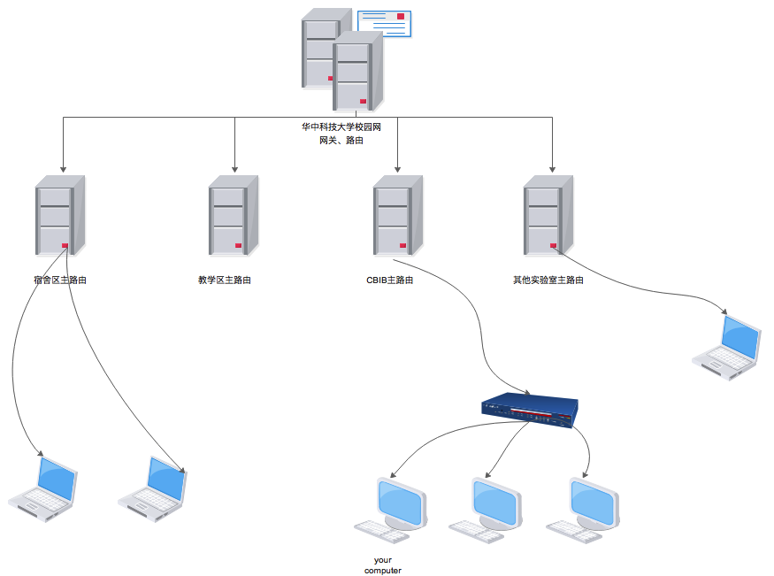
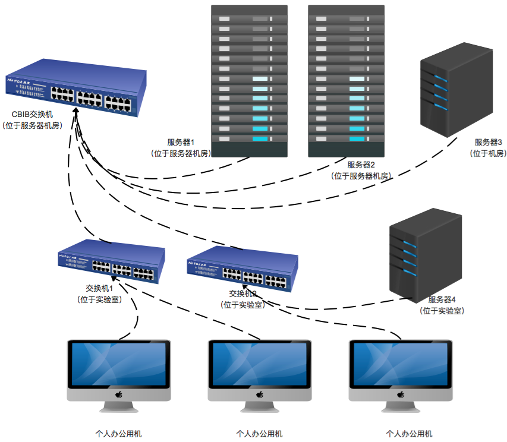
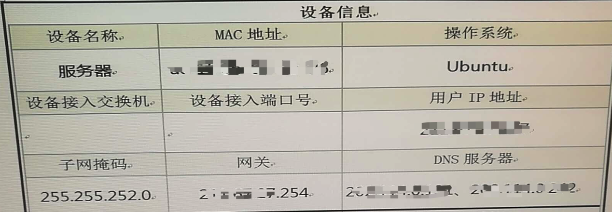
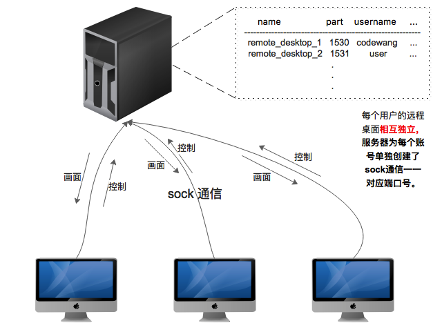
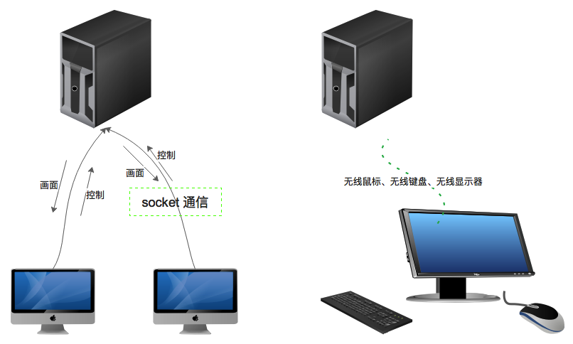
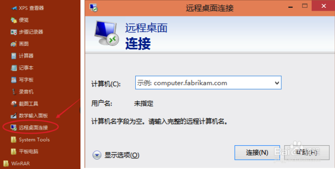
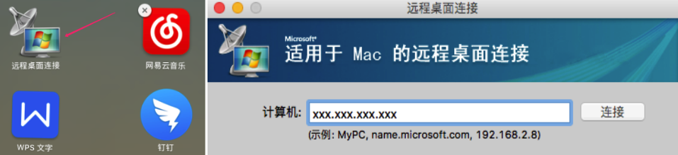
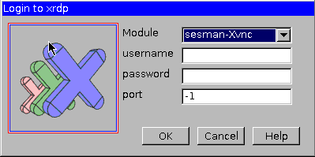
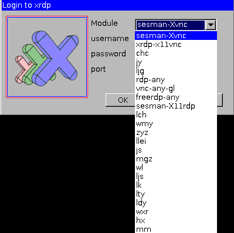

# CBIB Ubuntu Server Manual

| version | author | date       | diff  | other          |
| ------- | ------ | ---------- | ----- | -------------- |
| V1.0    | 王彬     | 2018.09.06 | Setup | initialization |

---

[TOC]

## 前言

      此指导书作为CBIB实验室公用Ubuntu服务器指导资料，包含但不局限于深度学习环境搭建、服务器运维、服务器日常维修、硬件维护、问题定位以及解决措施，仅供参考。**除此之外还配备常见FAQ**，见[README.md](./README.md)。希望以此传承下去，为后续师兄弟减少环境搭建工作量，节约学习时间。

**请历届管理员严格把守以下规则：**

-  服务其ip地址不得以任何形式对外泄露
-  不得将服务器账号租、借给实验室意外人员
-  不使用GPU（仅占用CPU）的项目不得使用服务器
-  实验室老成员毕业离校后，及时回收账号
-  同一项目同一程序一次不得使用超过4块GPU，特殊情况除外
-  任何人不得私自删除、升级**公用库**（cuda、cudnn、tensorflow、keras、pytorch、caffa等），需经过管理员和大家一致同意后方可升级
-  普通用户（非管路员）不得修改`/etc/profile`、`/etc/bashrc`等公共配置文件
-  每人限制一个服务器账号，不使用远程桌面（或使用频率低于2次/天）的用户，远程桌面应该处于常关状态
-  除管理员和负责人(金人超老师)以外，任何人不得使用root登录，root密码不得向任何人泄露
-  服务器机房每天必须检查一次，确保空调处于开启状态，室内温度不得超过40度
-  每隔一段时间要检查服务器机架后侧电线，防止温度过高造成电线老化漏电

----

此项目自2018.9.6发起，手册开源于github，由每一届服务器运维管理员负责维护。

> 2017.9~2018.9   管理员codewang， github地址<https://github.com/deeper-code/deeper-server>

---


## 第一章  服务器介绍

**Note：**后文中Linux发行版特指Ubuntu.本手册只提供命令行操作指导，不提供图像界面操作指导。

### 1.1 硬件

实验室目前共2台大服务器（10-GPU），2台小服务器（2-GPU）。其硬件配置如表1-1所示。

| 服务器编号 |  俗名   | GPU数量 |        GPU型号        |  显存  |  内存   |  硬盘  |                  CPU型号                   | 负责人  |
| :---: | :---: | :---: | :-----------------: | :--: | :---: | :--: | :--------------------------------------: | :--: |
|   1   | 老服务器  |  10   | GeForce GTX 1080 Ti | 12GB | 128GB | 12TB | `Intel(R) Xeon(R) CPU E5-2683 v3 @ 2.00GHz（2CPU-28核-64bit）` | 曹海潮  |
|   2   | 新服务器  |  10   | GeForce GTX 1080 Ti | 12GB | 128GB | 4TB  | `Intel(R) Xeon(R) CPU E5-2683 v3 @ 2.00GHz（2CPU-28核-64bit）` |  王彬  |
|   3   | 小服务器1 |   2   | GeForce GTX 1080 Ti | 12GB | 64GB  | 2TB  | `Intel(R) Xeon(R) CPU E5-2603 v4 @ 1.70GHz (1GPU-6核-64bit)` |  王彬  |
|   4   | 小服务器2 |       | GeForce GTX 1080 Ti | 12GB | 64GB  | 2TB  | `Intel(R) Xeon(R) CPU E5-2603 v4 @ 1.70GHz (1GPU-6核-64bit)` | 陆建国  |

<center> 表1-1 服务器硬件配置表 </center>

其中：

- 1号**老服务器**位于机房-服务器机架从上往下第一台（无外接显示器，无键鼠，与2号公用）
- 2号**新服务器**位于机房-服务器机架从上往下第二台（有外接显示器，有键鼠）
- 3号**小服务器1**位于实验室-进门第4排-右数4号桌（有外接显示器，有键鼠）
- 4号**小服务器2**位于机房-进门空调旁边（无外接显示器，无键鼠）

### 1.2 软件

        软件配置涉及到大家的深度学习平台，格外重要。请管理员及时维护此表（表1-2），一旦出现私自更新、删除公用库可按照此表进行恢复。**这里只统计公用数据库，公用库，公用应用程序, \*表示未统计项，或不重要**

|       软件名称       |           1号           |           2号           |               3号                |               4号               |     表项维护人@维护日期      |
| :--------------: | :--------------------: | :--------------------: | :-----------------------------: | :----------------------------: | :-----------------: |
|       `OS`       | `Ubuntu LTS 14.04(出厂)` | `Ubuntu LTS 14.04(出厂)` | `Ubuntu LTS 16.04  (王彬@2018.6)` | `Ubuntu LTS 16.04（陆建国@2018.6）` | `codewang@2018.9.6` |
|      `CUDA`      |         `9.0`          |         `8.0`          |              `9.0`              |             `9.0`              | `codewang@2018.9.6` |
|     `cudnn`      |          `*`           |          `*`           |              `8.5`              |              `*`               | `codewang@2018.9.6` |
| `nvidia-driver`  |       `384.130`        |        `384.69`        |            `384.130`            |              `*`               | `codewang@2018.9.6` |
|    `python3`     |        `3.4.3`         |        `3.4.3`         |             `3.6.5`             |              `*`               | `codewang@2018.9.6` |
| `Tensorflow`-gpu |        `1.3.0`         |        `1.4.0`         |             `1.8.0`             |              `*`               | `codewang@2018.9.6` |
|  `Tensorboard`   |        `0.1.8`         |        `0.4.0`         |             `1.8.0`             |              `*`               | `codewang@2018.9.6` |
|     `Keras`      |        `2.0.8`         |        `2.1.6`         |             `2.2.0`             |              `*`               | `codewang@2018.9.6` |
|    `Pytorch`     |          `无`           |        `0.1.0`         |               `*`               |              `*`               | `codewang@2018.9.6` |
|     `Caffa`      |          `*`           |          `*`           |               `无`               |              `*`               | `codewang@2018.9.6` |
|     `Theano`     |          `*`           |        `1.0.2`         |               `无`               |              `*`               | `codewang@2018.9.6` |
|     `Mxnet`      |          `*`           |     `1.1.0.post0`      |               `无`               |              `*`               | `codewang@2018.9.6` |
|    `xgboost`     |        `0.6a2`         |         `0.71`         |               `无`               |              `*`               | `codewang@2018.9.6` |
|    `ipython`     |        `6.2.1`         |        `6.2.1`         |             `6.4.0`             |              `*`               | `codewang@2018.9.6` |
|     `Cython`     |        `0.27.3`        |        `0.27.3`        |            `0.28.2`             |              `*`               | `codewang@2018.9.6` |

<center> 表1-2 服务器软件配置表 </center>

### 1.3 IP地址

IP地址是向学校申请的固定IP地址，如表1-3所示，校内任何地方均可以访问。**切记不可将服务IP地址告诉他人。**

|  编号  |      IP地址       |
| :--: | :-------------: |
|  1号  | xxx.xxx.xxx.253 |
|  2号  | xxx.xxx.xxx.232 |
|  3号  | xxx.xxx.xxx.226 |
|  4号  | xxx.xxx.xxx.225 |

<center> 表1-3 服务器IP配置表 </center> 

---


## 第二章 服务器配置

本章内容包括：

- 如何安装cuda、cudnn、tensorflow-gpu等深度学习框架，以及其配置过程
- 固定IP配置
- 远程桌面配置<需配合第三章 Linux运维，可先阅读第三章>

### 2.1 深度学习框架配置

由于实验室项目不尽相同，不同的项目组可能会使用不同的深度学习框架，管理员只需用维护tensorflow和keras即可。但是cuda、cudnn是所有框架公用的，所以升级和维护需要实现与各项目组沟通协调。目前实验室所使用的深度学习框架包括：`keras with tensorflow-backend`(刘老师、马老师项目组)、`caffa`（金老师项目组）、`matlab`（许老师项目组）、`other`，下面主要介绍cudnn、cuda以及tensorflow和keras的安装配置。

#### 2.1.1 深度学习库依赖关系

    我们知道CPU也好、GPU也好、硬盘、内存都是物理设备都属于硬件，那么操作系统或者计算机软件想要使用这些硬件，就需要驱动程序，这和Window是一样的。（虽然windows上有许多设备是免驱的，但是实质上他们使用的是公用驱动，万能驱动。比如鼠标、蓝牙键盘等，其实他们都是使用默认的USB设备驱动程序，所以可以免驱），所以我们想要使用GPU首先需要安装**驱动程序**。
    
       除此之外，tensorflow这样的深度学习框架也不可能直接和GPU驱动程序打交道，不然tensorflow的软件体量就太大了，所以NVIDIA公司为这些上层应用软件提供了一些辅助程序，称之为**cuda**和**cudnn**。
    
       然后就是我们熟悉的深度学习框架了，比如tensorflow、pytorch、mxnet、caffa等,**注意，Keras严格意义上来说并不是深度学习框架，它是以tensorflow或者theaon后后端的高级封装API库。**下面我们用一副图来了解它们的关系。如图2-1所示：


<center>图2-1 深度学习库依赖关系</center>

#### 2.1.2 Linux加载库过程简介

        本节，我将通过类比windows应用程序来解释Linux系统是如果启动应用程序，如何加载动态链接库的。假设我们在windows上安装一个QQ软件，其步骤如下：

- 下载QQ安装包，一般为`.exe`
- 安装
  - 选择安装位置，默认为`C:/Program files/xxx`
  - 创建桌面快捷方式
  - 安装完成
- 启动应用程序

实质上我们选择安装路径时，安装程序会将QQ安装包的内容，所需要的库文件，数据库等拷贝到我们指定的目录下，同时还会设置注册表（这个不清楚没关系）。然后创建桌面快捷方式比如`/Desktop/QQ`,当我们点击运行`QQ(快捷方式)`时系统会找到此快捷方式所指定的应用程序，也就是`C:/Program Files/xxx/QQ.exe`,然后就完成启动了。


Linux下的程序启动与Window类似，但也有些不同，首先linux不存在快捷方式，那么问题就来,linux是如何找到对应的应用程序的呢？

> Linux下启动应用程序，系统会根据环境变量 **PATH** 指定的路径，取对应的路径下查找应用程序。
>
> 我们可以使用echo命令查看环境变量：
>
> `echo $PATH`    `<--- $ 表示读取环境变量， echo是输出显示命令`
>
> (2号服务器)输出为：
>
> `/usr/local/MATLAB/R2014b/bin:/usr/local/cuda-8.0/bin:/usr/local/sbin:/usr/local/bin:/usr/sbin:/usr/bin:/sbin:/bin:/usr/games:/usr/local/games:/usr/lib/jvm/java-8-oracle/bin:/usr/lib/jvm/java-8-oracle/db/bin:/usr/lib/jvm/java-8-oracle/jre/bin`
>
> ---------
>
> 我们可以看到PATH环境变量中有很多路径，用 **: (冒号)**隔开，那么假设当我们在终端键入 `ls`命令时，实质上Linux系统会去这些路径下查找名称为`ls`的应用程序（默认优先查找当前路径`.`），最终会在`usr/local/bin/`找到`ls`程序，然后调用它，所以说我们运行`ls`其实是运行`/usr/local/bin/ls`.


那么同样的道理，如果程序需要加载某个动态链接库，那么它会去哪些路径下查找呢？答案是**LD_LIBRARY_PATH**


#### 2.1.3 Linux环境变量的配置

上面我们讲了Linux运行应用程序和加载动态链接库时所依赖的两个环境变量，下面我们讲解如何设置环境变量，每个用户的环境变量有什么区别?

首先我要强调一点，**Linux系统不是桌面系统，其设计之初就不是为日常办公而设计，它是一种多用户的服务器型的操作系统**，既然Linux是多用的操作系统，那么问题就随之而来，假如某台服务器上有AB两个用户，A用户安装了一个QQ轻量版并且设置了`PATH`环境变量，B用户又想使用完整版的QQ，于是他也下载安装了完整版的QQ，也设置了环境变量`PATH`， 那么这就造成的冲突。因此**Linux中每个用户的环境变量都是独立的！**

**a) 如何设置环境变量  ---> export**

Linux中我们使用`export`命令来设置环境变量，但是要主要环境变量有它自己的生命周期。设置的环境变量有效期直至当机器**重新启动**或者该环境变量被**覆盖**、被**删除**时。我们可以再命令行中使用`export`命令来设置环境变量，下面我们看一个例子：

``` shell
[codewang$] echo $HELLO_WORLD    --> 查看环境变量 `HELLO_WORLD`
                                 --> 该用户的该环境变量不存在，或者为空 
[codewang$] export HELLO_WORLD='never fight alone'   --> 定义环境变量
[codewang$] echo $HELLO_WORLD
never fight alone    --> 可以看到已经设置成功
  
[codewang$] logout   --> 退出登录
----------------------------------------------------------------
我们切换登录另一个用户 user
[user$] echo $HELLO_WORLD   --> 查看环境变量 `HELLO_WORLD`
                            --> 不存在，这也说明了用户的环境变量是独立的。
[user$]  
```

**b) 脚本设置环境变量  --> /home/username/.bashrc**

上面介绍了使用`export`来设置环境变量，但是也面临着一个问题，一旦机器重启那我们就得重新设置环境变量，这岂不是很麻烦，好在Linux系统在启动时会自动运行一些脚本(有兴趣的同学可以查阅相应资料)，在系统启动、或者用户登录时系统自动运行该用户`home`下的`.bashrc`脚本（shell 脚本）。所以每个用户都可以自己定制自己的启动脚本，那么我们就可以在该脚本中设置环境变量，就不用再操心系统重新的问题了。

``` shell
[codewang$] vim ~/.bashrc   --> ~的意思是当前用户的home目录，等价于/home/codewang
 
 -+-+-+-+-+-+-+-+ 以下为 /home/codewang/.bashrc 文件的内容 -+-+-+-+-+-+-+-+
 export PATH=xxx
 export LD_LIBRARY_PATH=xxx
 export HELLO_WORLD=xxx


 关于vim的使用，读者自行查阅资料。
 -+-+-+-+-+-+-+-+-+-+-+-+-+-+-+-+-+-+-+-+-+-+-+-+-+-+-+-+-+-+-+-+-+-+-+-+
```

**Note：**当我们编辑保存该脚本后，它要在系统重新或者用户登录时才会被调用，如果你编辑了该文件想立即生效那么我们可以运行`source`命令：`[codewang$] source ~/.bashrc`

**C) 通用环境变量配置 --> /etc/profile**

服务器上有很多大家公用的软件，公用的库文件，难道每个用户都要自己去一一配置环境变量吗？一旦某个库更新了，管理员要一个用户一个用户的取修改他们的`.bashrc`文件吗？这当然是不能忍受的。Linux在启动时还会调用一个脚本文件`/etc/profile`,它和每个用户目录下的`.bashrc`类似，区别在于**它设置的环境变量对所有用户有效！！！并且先于每个用户的.bashrc运行**

- 对所有用户有效

  我们可以很方便的为所有用户设置公共软件路径，公共库路径，例如tensorflow、cuda等公共库，管理员就可以设置`/etc/profile`来为所有用户设置`PATH和LD_LIBRARY_PATH`环境变量

- 先于每个用户的`.bashrc`运行

  这也说明了，如果`profile`中为每个用户设定了`PATH`,而某个用户自己的`.bashrc`也设置了`PATH`环境变量，那么**后者会覆盖前者**。

好了，设置环境变量就介绍这么多，其实linux设置环境变量的方式不止以上几种，但是我们常用的就是上面的方式，有兴趣的同学可以自行查阅相关资料。下面我们通过实例说明该如何**有效**的设置环境变量.

> 让我们先做以下假设：
>
> - 管理员在 `/usr/local/cuda`下安装了`cuda8.0`, 其中cdua的应用程序在`bin`目录下，库文件在`lib64`目录下。
> - `codewang`觉得`cuda8.0`太老旧了，自己想使用`cuda9.0`,并下载安装了`cuda9.0`安装在了`/usr/local/cuda-9.0`下面，同样的应用程序在`bin`目录下，库文件在`lib64`目录下。
>
> **管理员**
>
> 作为管理员，只要用户不破坏公共库，公共资源，原则上用户有使用任何版本的软件的自由，所以管理员
>
> 只能操作`/etc/profile`文件，不可擅自改动某个用户的`/home/username/.bashrc`文件,普通用户也不可以擅自修改`/etc/profile`文件。
>
> ``` shell
> ----- 以下为标准的/etc/profile文件配置 -----
>
> # modified by codewang @2018.09.07     --> 修改文件添加备注，这是管理员的责任
> export PATH=$PATH:/usr/local/cuda/bin  
> export LD_LIBRARY_PATH=$LD_LIBRARY_PATH:/usr/local/cuda/lib64
>
> # 解释
> # export PATH=$PATH:/usr/local/cuda/bin  
> # 首先PATH=$PATH  也就是等于原内容，然后后面追加内容，我们之前讲过多个路径用冒号隔开
> # 因此该命令的含义为：给PATH后面追加:/usr/local/cuda/bin
> # 这样就不会覆盖原来的环境变量了
> ```
>
> **codewang**
>
> 上面管理员为所有用户配置了`PATH和LD_LIBRARY_PATH`,但是我不想用`cuda8.0`，所以我可以通过设置我自己的环境变量来实现，同时还不影响其他用户。因此我只需用设置我自己的`.bashrc`文件即可。
>
> ``` shell
> ----- 以下为 codewang 的个人定制 ~/.bashrc 文件内容 -----
>
> export PATH=$PATH:/usr/local/cuda-9.0/bin  
> export LD_LIBRARY_PATH=$LD_LIBRARY_PATH:/usr/local/cuda-9.0/lib64
>
> # 解释
> # 管理员设置了两个环境变量，我又在后面追加我自己想用的cuda9.0
> # 这样，我的环境变量就包含了cuda8.0和cuda9.0， tensorflow依赖
> # 哪个版本它会自己查找的。
> #
> # 如果 codewang想强制只使用cuda9.0，不想使用管理员设置的cuda8.0怎么办？
> # 其实很简单：
> #  1. 首先 echo $PATH 查看当前环境变量内容
> #  2. 替换掉对于内容即可(cuda替换为cuda-9.0)
> # 或者：
> export PATH=/usr/local/cuda-9.0/bin:$PATH  
> export LD_LIBRARY_PATH=/usr/local/cuda-9.0/lib64:$LD_LIBRARY_PATH
> #我把自己想用的库放在环境变量的最前面，那么系统在搜索库时就会优先所有我指定的啦。
> ```
>
> 实质上，指定不同版本的python、不同版本的tensorflow或者是anacanda等都是这个原理。


#### 2.1.4 Driver、CUDA、cudnn下载

**Note：**在安装CUDA、cudnn之前要先确认操作系统版本、将要安装的tensorflow版本或者其他深度学习框架的版本。这里离tensorflow为例。

我们可以先去`github`上查看想要安装的tensorflow版本所需要的cudn版本,或者google。这里假设我们要安装的tensorflow版本为`1.9.0`，其需要的cuda版本为`cuda9.0`以上，keras对应的版本为`2.1.6`,同时cuda9.0对应的cudnn版本为`8.0`,除此之外还有GPU驱动驱动程序的版本假设为`384.69`

驱动程序、cuda、cudnn均从NVIDIA官网下载： https://www.nvidia.com/zh-cn/

**a) 下载驱动程序**

- 前往NVIDIA官网，找到驱动程序->所有驱动程序

  

- 根据我们的GPU硬件选择相应的版本，点击搜索（最好选择英文版，一劳永逸）

  

- 点击下载即可，然后上传到服务器，建议将历史版本的下载包存储下来以备用。也可以直接在服务器上下载。

  

- 然后我们就得到了名称为`NVIDIA-Linux-x1080ti-384.69.run`

  假设我将此文件存放在`/home/user/Download/NVIDIA-Linux-x1080ti-384.69.run`下

**b) 下载CUDA**

- 同样的，我们在首页找到：开发者->CUDA

  

- 进入页面后，点击`Download Now`,然后根据机器配置勾选相应选项，最好下载`.run`文件。这个页面默认是下载最新版本的CUDA，如果需要旧版本自行查找，方法类似。

  

- 最终我们会得到一个`cuda_9.3.148_396.37_linux.run`的文件，同样的上传至服务器，建议备份。

  假设我存放在了`/home/user/Download/cuda_9.3.148_396.37_linux.run`

**c) 下载cudnn** https://developer.nvidia.com/cuDNN

- 下载cuDNN需要登录，所以你要现在NVIDIA官网上注册。这里就略过了，下载方法与上面类似。

  

- 最终我们可以得到一个`cudnn-8.0-linux-x64-xxx.tgz`

  假设我存在：`/home/user/Download/cudnn-8.0-linux-x64-xxx.tgz`


#### 2.1.5 Driver、CUDA、cudnn安装

上述三个安装包下载完成后，我们就有了：

``` shell 
/home/user/Download/NVIDIA-Linux-x1080ti-384.69.run   --> NVIDIA显卡驱动程序
/home/user/Download/cuda_9.3.148_396.37_linux.run     --> CUDA
/home/user/Download/cudnn-8.0-linux-x64-xxx.tgz       --> cdDNN
```

**a) 安装驱动程序**

GPU也就是我们所说的显卡，它有可能已经应用在我们服务器配置的显示器上了，而出厂默认安装的是用于高性能显示的驱动程序,或者老旧的驱动程序，所以我们要先做一下清理工作。

- 卸载原来的驱动程序

  `sudo apt-get remove -purge nvidia*`

- 禁用`nouveau`

  `sudo vim /etc/modprobe.d/blacklist-nouveau.conf`

  输入以下内容并保存，即可将nouveau添加到黑名单，该驱动程序将不会再被加载。

  ``` shell 
  blacklist nouveau
  options nouveau modeset=0
  ```

- 刷新

  `sudo update-initramfs -u`

  然后**重启系统**

- 重启后，检查是否禁用nouveau成功

  `lsmod | grep nouveau` ， 如果没有输出内容则表示禁用成功。

- 切换到命令行界面

  因为我们要重新安装GPU驱动，所以图形界面需要暂时关闭。

  ``` shell
  # 切换到终端界面
  Ctrl + Alt + F1  (Ctrl + Atl + Fx 表示切换到x终端，其中F7表示图像界面)
  # 关闭图形界面
  user$ sudo service lightdm stop
  ```

- 开始安装NVIDIA显卡驱动(runfile)

  ``` shell
  # 进入驱动程序对应的目录
  user$ cd /home/user/Download/
  # 增加可执行权限
  user$ sudo chmod +x NVIDIA-Linux-x1080ti-384.69.run
  # 执行.run，开始安装
  user$ sudo ./NVIDIA-Linux-x1080ti-384.69.run –no-x-check –no-nouveau-check –no-opengl-files
  # –no-opengl-files 只安装驱动文件，不安装 OpenGL 文件。这个参数最重要
  # –no-x-check 安装驱动时不检查 X 服务
  # –no-nouveau-check 安装驱动时不检查 nouveau
  ```

- 启动图像界面

  ``` shell
  # 启动图像界面
  sudo service lightdm start
  # 切换到图像界面
  Ctrl + Atl + F7
  ```

- 检查驱动程序是否安装成功

  ``` shell
  user$ nvidia-smi
  ```

  如果安装成功，会出现 类似如下的界面,可以看到驱动版本为 `384.69`：

  

**b)  安装 CUDA**

和安装驱动程序类似，我们的CUDA库选择的也是run文件形式来安装，CUDA不需用关闭图形界面，所以可以直接在终端里执行安装。

``` shell
# 增加可执行权限
user$ sudo chmod +x cuda_9.3.148_396.37_linux.run
# 开始安装
user$ ./cuda_9.3.148_396.37_linux.run

# Description
# 
# This package includes over 100+ CUDA examples that demonstrate
# various CUDA programming principles, and efficient CUDA
# implementation of algorithms in specific application domains.
# The NVIDIA CUDA Samples License Agreement is available in
# Do you accept the previously read EULA?
# accept/decline/quit: accept
# 
# Install NVIDIA Accelerated Graphics Driver for Linux-x86_64 367.48?
# (y)es/(n)o/(q)uit: n  ---> 是否安装驱动程序？ 我们安装过了，所以选择 no
# 
# Install the CUDA 9.0 Toolkit?
# (y)es/(n)o/(q)uit: y  ---> 是否安装CUDA 工具箱， 选择 yes
# 
# Enter Toolkit Location
#  [ default is /usr/local/cuda-9.0 ]: ---> 安装位置，默认即可
# 
# Do you want to install a symbolic link at /usr/local/cuda?
# (y)es/(n)o/(q)uit: y  ---> 是否安装动态链接文件，选择yes
# 
# Install the CUDA 9.0 Samples?
# (y)es/(n)o/(q)uit: y   ---> cuda自带了一些示例程序，我们选择 yes。之后可以做一些验证工作。
# 
# Enter CUDA Samples Location
#  [ default is /xxxx ]:  ---> 示例程序的安装位置， 默认即可
# 
# Installing the CUDA Toolkit in /usr/local/cuda-9.0 ...
# Installing the CUDA Samples in /xxx ...
# Copying samples to /xxxx now...
# Finished copying samples.
```

至此，run文件已经将我们需要的CUDA动态链接库安装到了`/usr/local/cuda-9.0/（默认）`下面。相信你还记得我们在上一节中讲到的，Linux系统需要我们设定环境变量才能让其他应用程序能够找到我们安装的动态链接库，所以下来我们要设置环境变量。

如果你是管理员，请为所有人设置环境变量（`/etc/profile`），如果你是普通用户安装了自己需要的定制版CUDA那么请设置(`~/.bashrc`),这里我们给出`/etc/profile`的设置示例，具体原理不再赘述，参考2.1.3小节：

``` shell
# Add CUDA-9.0 Library.  modify by codewang @2019.9.16
export PATH=/usr/local/cuda-9.0/bin:$PATH
export LD_LIBRARY_PATH=/usr/local/cuda-9.0/lib64:$LD_LIBRARY_PATH
```

**c) 安装cudnn加速库**

因为cudnn是用来做动态加速运算的库，但是并不是所有NVIDIA显卡用户都要用到此部分功能，所以NVIDIA讲此部分库从CUDA中独立出来，形成了现在的cudnn，因此与其说是安装cudnn库，不如说是给CUDA打补丁，所以可以看到我们下载的cudnn库时压碎文件，并不需要安装。我们只需用将其解压，将对应问价拷贝至CUDA安装目录下即可。

``` shell
# 解压 cudnn 
user$ tar -xvzf cudnn-8.0-linux-x64-xxx.tgz  --> 假设解压得到 cuda 目录
# 拷贝动态链接库到CUDA安装目录下
user$ sudo cp ./cuda/lib64/libcudnn* /usr/lcoal/cuda-9.0/lib64/
# 拷贝头文件到CUDA安装目录下
user$ sudo cp ./cuda/inlcude/cudnn.h /usr/local/cuda-9.0/include/
# 因为是刚解压出来的文件，其权限是不确定的，为了以防万一，我们手动为其增加可读权限
user$ sudo chmod a+r /usr/lcoal/cuda-9.0/lib64/libcudnn*
user$ sudo chmod a+r /usr/local/cuda-9.0/include/cudnn.h
```

**d) 验证**

这里我们可以验证前面三个库的安装是否正确，利用上面提到的CUDA的示例程序。路径为`/usr/local/cuda-9.0/samples/1_Utilities/deviceQuery`

``` shell
# 进入示例程序目录
user$ cd /usr/local/cuda-8.0/samples/1_Utilities/deviceQuery
# 编译示例程序
user$ sudo make   --> 我们可以看到生成了 deviceQuery 的可执行程序
# 运行观察结果
user$ ./deviceQuery
#
#  ----------- 只作为示例，仅供参考 -----------
#
# CUDA Device Query (Runtime API) version (CUDART static linking)
# Detected 10 CUDA Capable device(s)
# Device 0: "GeForce GTX 1080 Ti"
# CUDA Driver Version / Runtime Version           9.0 / 9.0
#  CUDA Capability Major/Minor version number:    6.1
#  Total amount of global memory:                 11172 MBytes (11715084288 bytes)
#  (28) Multiprocessors, (128) CUDA Cores/MP:     3584 CUDA Cores
#  GPU Max Clock rate:                            1582 MHz (1.58 GHz)
#  Memory Clock rate:                             5505 Mhz
#  Memory Bus Width:                              352-bit
#  L2 Cache Size:                                 2883584 bytes
#  Maximum Texture Dimension Size (x,y,z)         1D=(131072), 2D=(131072, 65536), 3D=(16384, 16384, 16384)
#  Maximum Layered 1D Texture Size, (num) layers  1D=(32768), 2048 layers
#  Maximum Layered 2D Texture Size, (num) layers  2D=(32768, 32768), 2048 layers
#  Total amount of constant memory:               65536 bytes
#  Total amount of shared memory per block:       49152 bytes
#  Total number of registers available per block: 65536
#  Warp size:                                     32
#
#   ...
#   ...
#
# deviceQuery, CUDA Driver = CUDART, CUDA Driver Version = 9.0, 
# CUDA Runtime Version = 9.0, NumDevs = 10, Device0 = GeForce GTX 1080 Ti, Device1 = 
# GeForce GTX 1080 Ti, Device2 = GeForce GTX 1080 Ti, Device3 = GeForce GTX 1080 Ti, 
# Device4 = GeForce GTX 1080 Ti, Device5 = GeForce GTX 1080 Ti, Device6 = GeForce GTX
# 1080 Ti, Device7 = GeForce GTX 1080 Ti, Device8 = GeForce GTX 1080 Ti, Device9 = 
# GeForce GTX 1080 Ti
# Result = PASS    ---> 表示安装正确
```


#### 2.1.6 Tensorflow/Keras的安装

安装tensorflow、keras、pytorch、caffa等框架就相对简单很多了，使用pip安装即可，或者conda安装。

``` shell
# 安装tensorflow-gpu 
user$ sudo pip3 install tensorflow-gpu # ---> 安装最新版tensorflow gpu版本
# 也可以指定安装版本
user$ sudo pip3 install tensorflow-gpu==1.6.0 # ---> 安装1.6.0版本
# keras 安装
user$ sudo pip3 install keras==2.2.0 
#
# 这里做一点补充， 由于我们的设备一般自带python2.x， 我们也安装了python3.x
# 我们一般使用python3.x(python2.x已经不再维护了)， 所以安装库时要用对应的pip3,而不是pip
```


### 2.2 固定IP配置

  本节将介绍申请固定IP的过程，和如何给服务器配置固定IP地址。

#### 2.2.1 校园网的组成




无论你在校园内的任何地方，只要使用校园网那么最终都会通过学校的总路由、网关而访问英特网，所以无论你在学校的何处只要你有一根网线能够连接到校园网（可以不登录），或者使用无线网连接到校园网，都可以访问学校内的公开IP地址（相当于外网）。

#### 2.2.2 CBIB实验室局域网组成



而我们实验室的网络步骤也是一个局域网，所以你可以在不连接校园网的情况下访问服务器，下面我们分情况讨论为什么一定要给服务器配置校内固定IP。

- **服务器不连接校园网，固定IP地址**

  上面我们说了，因为实验室内所有机器都在一个局域网内，所以就算服务器不连接校园网，只要将网线连接至CBIB的交换机上，我们就可以在局域网内访问服务器了，但是问题在于我们的服务器是不能访问外网的，那么我们想更新软件，下载安装包都无法实现，只能使用自己的电脑下载好安装包，然后上传至服务器安装相当的麻烦。

- **服务器登录校园网账号**

  另一种方式就是给服务器登录校园网账号，这样服务器便可以访问外网了，解决了上述的问题，但是使用校园网账号登录时其IP地址是不固定的，我们每次登录服务器都要先查看其IP地址，因此此方法也不可行。

- **服务器使用校内固定IP，免登录**

  最终的解决方案就是向学校校园网中心申请固定IP。首先固定IP地址是不需要登录的，可以直接访问外网，其次其IP地址不会发生变化。具体申请固定IP的流程可请教@金老师或者@马老师。申请固定IP需要向校园网中心提供机器的MAC地址，校园网中心会下发一个全校可访问的公共IP地址与我们提交的MAC地址绑定，然后我们的服务器就可以免费上网了。

  **如何查看MAC地址**

  ``` shell
  user$ ifconfig

  eth0      Link encap:Ethernet  HWaddr xx:xx:xx:xx:xx:xx  
            UP BROADCAST MULTICAST  MTU:1500  Metric:1
            RX packets:0 errors:0 dropped:0 overruns:0 frame:0
            TX packets:0 errors:0 dropped:0 overruns:0 carrier:0
            collisions:0 txqueuelen:1000 
            RX bytes:0 (0.0 B)  TX bytes:0 (0.0 B)
            Memory:fb300000-fb37ffff 

  eth1      Link encap:Ethernet  HWaddr xx:xx:xx:xx:xx:xx  
            inet addr:xxx.xxx.xxx.xxx  Bcast:xxx.xxx.xxx.xxx  Mask:255.255.252.0
            inet6 addr: fe80::ae1f:6bff:fe14:4a4f/64 Scope:Link
            inet6 addr: 2001:250:4000:8240:ae1f:6bff:fe14:4a4f/64 Scope:Global
            UP BROADCAST RUNNING MULTICAST  MTU:1500  Metric:1
            RX packets:117381703 errors:0 dropped:0 overruns:0 frame:0
            TX packets:449580661 errors:0 dropped:0 overruns:0 carrier:0
            collisions:0 txqueuelen:1000 
            RX bytes:62143220880 (62.1 GB)  TX bytes:645669845490 (645.6 GB)
            Memory:fb200000-fb27ffff 

  lo        Link encap:Local Loopback  
            inet addr:127.0.0.1  Mask:255.0.0.0
            inet6 addr: ::1/128 Scope:Host
            UP LOOPBACK RUNNING  MTU:65536  Metric:1
            RX packets:2271267728 errors:0 dropped:0 overruns:0 frame:0
            TX packets:2271267728 errors:0 dropped:0 overruns:0 carrier:0
            collisions:0 txqueuelen:1 
            RX bytes:6361168372943 (6.3 TB)  TX bytes:6361168372943 (6.3 TB)
            
  # 其中 eth0表示服务器的第一块网卡， eth1同理， lo表示本地回环地址
  # 一般我们只使用一块网卡即可，在服务器2中我们使用的是eth1
  # 其中：
  #    HWaddr(hardwarw address) 就是该网卡的MAC地址
  #    inet addr ： 表示该网卡的ip地址
  #    其他
  ```

  申请单下发后大致是这个样子：

  

#### 2.2.3 固定IP的配置

我们从申请单可以得到

``` shell
MAC地址： MAC:MAC:MAC:MAC:MAC:MAC
IP地址 ： ip.ip.ip.ip
子网掩码： 255.255.252.0
网关   ： way.way.way.way
DNS   ： DNS1.DNS1.DNS1.DNS1, DNS2.DNS2.DNS2.DNS2

# 请注意在你申请IP时提交的MAC 地址是哪一张网卡的，接下来的配置就要在哪一张网卡上进行。MAC地址不匹配
# 是不能上网的。
```

**a) 修改 /etc/network/interface**

``` shell
user$ sudo vim /etc/network/interface

# ------ 以下为示例内容 --------
# The loopback network interface
auto lo    ---> 这是本地回环的配置，我们不需用管
iface lo inet loopback

# The primary network interface
auto eth1  # ---> 先让个自动获取IP，激活网卡
iface eth1 inet static  # ---> IPv4 设置为固定IP模式
address ip.ip.ip.ip     # ---> 固定IP
netmask 255.255.252.0   # ---> 子网掩码
gateway way.way.way.way # ---> 网关

# 保存退出
```

**b) 修改 /etc/resolvconf/resolv.conf.d/base**

这一步的目的是配置DNS

``` shell
user$ sudo vim /etc/resolvconf/resolv.conf.d/base

# ------ 以下为示例内容 --------
nameserver DNS1.DNS1.DNS1.DNS1
nameserver DNS2.DNS2.DNS2.DNS2

# 保存退出
```

**c) 刷新配置， 重新网卡**

``` shell
user$ sudo resolvconf -u  # ---> 刷新网络配置
user$ sudo /etc/init.d/networking restart  # ---> 重启网络服务
```

然后终端检查IP地址是否设置正确，是否可以访问外网，实验室内个人PC是否可以访问服务器。

如果重启网络服务不能生效的话可以试一试重启服务器。

---


### 2.3 SSH 服务配置

SSH全称(Secure Shell)，也是程序员最喜欢的服务器登录方式，可以看成是远程的终端。SSH分为客户端和服务端，服务端是常驻于内存的，是一个守护进程我们称之为**sshd**, 我们登录时用的就是客户端了。

#### 2.3.1 SSH安装

ssh是免费软件，我们可以很容易的安装它，在Ubuntu下只需要执行：

`sudo apt-get install openssh-server openssh-client`

#### 2.3.2 SSHD的配置

由于是远程登录的软件，所以免不了要进行一些配置，包括安全方面的，登录限制等等。sshd的配置文件为`/etc/ssh/sshd_config`, 一般使用默认配置即可，但是我们要多做一步**禁止root用户登录**， 之前我们也讨论过，root用户拥有至高无上的权限，所以为了安全起见，root用户是不可以远程登录的。

``` shell
# --------- /etc/ssh/sshd_config ------------
# 以下为参考内容
Port 22  # “Port”设置sshd监听的端口号。

ListenAddress 192.168.1.1  # “ListenAddress”设置sshd服务器绑定的IP地址。

HostKey /etc/ssh/ssh_host_key # “HostKey”设置包含计算机私人密匙的文件。

KeyRegenerationInterval 3600 # KeyRegenerationInterval”设置在多少秒之后自动重新生成服务器的密匙（如果使用密匙）。重新生成密匙是为了防止用盗用的密匙解密被截获的信息。

ServerKeyBits 768  # “ServerKeyBits”定义服务器密匙的位数。


SyslogFacility AUTH  # “SyslogFacility”设置在记录来自sshd的消息的时候，是否给出“facility code”。


LogLevel INFO # “LogLevel”设置记录sshd日志消息的层次。INFO是一个好的选择。查看sshd的man帮助页，已获取更多的信息。

 
LoginGraceTime 120 # “LoginGraceTime”设置如果用户不能成功登录，在切断连接之前服务器需要等待的时间（以秒为单位）。


PermitRootLogin no  # “PermitRootLogin”设置root能不能用ssh登录。这个选项一定不要设成“yes”。

 
StrictModes yes # “StrictModes”设置ssh在接收登录请求之前是否检查用户家目录和rhosts文件的权限和所有权。这通常是必要的，因为新手经常会把自己的目录和文件设成任何人都有写权限。


ClientAliveInterval 300（默认为0） # 每5分钟，服务器向客户端发一个消息，用于保持连接


IgnoreRhosts yes # “IgnoreRhosts”设置验证的时候是否使用“rhosts”和“shosts”文件。


IgnoreUserKnownHosts yes # “IgnoreUserKnownHosts”设置ssh daemon是否在进行RhostsRSAAuthentication安全验证的时候忽略用户的“$HOME/.ssh/known_hosts”
```


#### 2.3.3 客户端登录选项

我们使用ssh登录时，打开终端软件键入：`ssh  username@IP` 即可登录。

```shell
> ssh codewang@xxx.xxx.xxx.xxx  # 以用户codewang身份登录服务器SSHD服务
> codewang@xxx.xxx.xxx.xxx's password:  # 输入密码即可登录
```

### 2.4 远程桌面配置

<center>此部分挪动到第三章</center>


## 第三章 Linux运维

为了能更有条理的讲解服务器远程桌面配置，我将此部分内容移动至本章（第三章）。本章涉及常用的Linux运维知识，例如`文件权限`、`用户权限`、`用户的增删改查`、`分组`，`远程桌面配置`等。Linux运维是一门大学科，这里不可能面面俱到，我只是把实验室服务器运维常用的一些知识点和个人的一些小建议编写在此，难免有纰漏，望指正。

**如果有对Linux运维有兴趣的同学，推荐阅读《鸟哥的Linux 私房菜》系列书籍**

### 3.1 Linux用户管理

Linux作为多用户操作系统，用户的管理、用户之间的隔离、用户的权限是必不可少的关键因素。这里将简要介绍Linux中常用的一些用户管理的知识，让我们一起领略一下Linux是怎么做到让多个用户在一台机器上工作而又不会互相冲突且能相互合作的。当然！这些都是理想情况（每个用户都是老鸟），对于萌新一直是让管理员头疼的存在，所以说管理一群对linux不了解的用户着实是一个难题，特别是对我这种运维半吊子来说，不懂高级的运维操作，只能用传统的入门级方法苟且偷生，还要被人鄙视不懂还装逼（骑虎难下）。

#### 3.1.1 Linux下的三类用户

说到用户大家首先想到的肯定是`管理员即root用户`、`普通用户`，那怎么会出现第三个用户呢？其实是软件、应用程序，我们安装一个QQ程序，那么这个QQ程序想要读写某个文件、访问我们的摄像头怎么办？比如是张三安装的QQ，难道QQ就不能访问系统目录了吗？所以linux系统还存在第三个用户即`伪用户`。

**a) root用户**

root用户是唯一的，一台机器只能有一个root用户，root用户拥有神一般的权限，哪怕是删除系统的权限它都有。因为root用户的权限太高，所以一般我们建议不能使用远程登录的方式登录root账号，root密码也是绝对不能随便告诉其他人的，可以想象一下如果被某个黑客、破坏者拿到root密码，远程登录到服务器那会是多么可怕。**root用户的UID（user id）为0**。**我们常说的管理员！不是指root用户，root用户是账号、管理员是人！，通常管理员也是登录自己的账号来维护服务器，而不是登录root账号**


**b) 伪用户**

上面我们也说了，伪用户是为了方便系统管理、应用程序、满足相应的系统进程文件属主的要求而设立的。**伪用户不能登录系统**，其UID为1~499


**c) 普通用户**

普通用户就是我们平常使用的登录账号了，一般情况下包括管理员在内所有服务器使用者都应该是普通用户的账号。其UID在500~6000,具有有限的权限，比如只能写自己的所属文件、只能修改删除自己创建的文件夹等，不能安装应用程序到系统目录等。关乎权限 问题后面我们会详细介绍。

-----

关于用户的其他信息，linux系统中有个叫做`/etc/passwd`的文件，其中记录了每一个用户的信息，我们打开看一看其具体内容：

``` shell
# ------------------ /etc/passwd 文件样例内容 ------------------------------------

# root:x:0:0:root:/root:/bin/bash
# daemon:x:1:1:daemon:/usr/sbin:/usr/sbin/nologin
# bin:x:2:2:bin:/bin:/usr/sbin/nologin
# sys:x:3:3:sys:/dev:/usr/sbin/nologin
# sync:x:4:65534:sync:/bin:/bin/sync
# games:x:5:60:games:/usr/games:/usr/sbin/nologin
# man:x:6:12:man:/var/cache/man:/usr/sbin/nologin
# mail:x:8:8:mail:/var/mail:/usr/sbin/nologin
# syslog:x:101:104::/home/syslog:/bin/false
# lightdm:x:112:118:Light Display Manager:/var/lib/lightdm:/bin/false
# 
# ...
# 
# user:x:1000:1000:user,,,:/home/user:/bin/bash
# sshd:x:116:65534::/var/run/sshd:/usr/sbin/nologin
# codewang:x:1001:1024::/home/codewang:/bin/bash
# jy:x:1004:1024::/home/jy:/bin/bash
# ll:x:1005:1024::/home/ll:/bin/bash
# jrc:x:1007:1024::/home/jrc:/bin/bash
# xrdp:x:120:128::/var/run/xrdp:/bin/false
# 
# ...
# 
# wzd:x:1030:1024::/home/wzd:/bin/bash
# lp:x:1031:1024::/home/lp:/bin/bash
# cookcoder:x:1006:1002:,,,:/home/cookcoder:/bin/bash
# jjl:x:1032:1024::/home/jjl:/bin/bash
# czm:x:1033:1024::/home/czm:/bin/bash

...
```

这是2号服务器的`/etc/passwd`的部分内容。可以看到此文件的每一行对应一个用户，每一行分为7个部分用冒号隔开，分别为`账号名称:用户密码:用户标识码（UID）:组标识码(GID):用户相关信息:用户home目录:用户环境`

这里我们就三种用户分别看一下其内容分别代表什么。

- `root:x:0:0:root:/root:/bin/bash`

  ``` shell
  第一行是root用户的信息:

  用户名称 : root,

  密码: 是加密的所以显示为x,

  用户ID（UID） : 0

  组ID（GID）: 0 ，关于组(group)后面会讲解, (是当前有效分组)

  用户相关信息 : root

  home目录 : /root

  用户环境 : /bin/bash ,用户环境是指bash解析器，我们在命令行写命令，或者写脚本都需要一个解析器来解析我们输入的内容，一般包括/bin/bash、/bin/sh等，一般推荐使用/bin/bash

  ```

- `sshd:x:116:65534::/var/run/sshd:/usr/sbin/nologin`

  sshd 就是我们用于远程登录的ssh服务，从这也可以证实为什么Linux需要第三个用户类型了，我们每个人使用ssh登录后，所有发送给服务器的命令，都是通过ssh服务转发的，所以sshd需要非常特殊的权限。

  同时我们注意到其`UID=116`确实是伪用户的UID，其home目录是`/var/run/sshd`指向了其运行时需要的一些临时使用的目录，特别的其用户环境是`/usr/sbin/nologin`这也说明了伪用户是不可以登录的。


- `codewang:x:1001:1024::/home/codewang:/bin/bash`

  这是我的账号的相关系，可以看到UID是1001， 我们实验室的用户ID是从1001开始的，组1024是组ID表示CBIB组（后面详解），home目录是/home/codewang。其实每个用户的home目录是可以更改的，而且不一定非要在`/home/`下面，可以放在硬盘上或者其他地方，而当我们更改home目录后此文件也会有相应的变换。

  我们回顾一下，前一章讲到一个小技巧：`如何快速的进入我的home目录， 我们讲到使用cd ~/` 其中`~`就表示当前用户的home目录，那么当解析器`/bin/bash`看到`~`之后，就回去查询`/etc/passwd`中找到对应用户从而得到其home目录的路径。


#### 3.1.2 linux 文件权限

Linux中有一句非常重要的定理：**一切皆文件！**，在Window中可能存在驱动程序，应用程序，各种注册表等，但是在linux中无论是什么都是文件！比如USB鼠标，安装驱动后其在用户空间的表示形式就是设备文件（设备节点），一切都是文件。所以文件的权限也是Linux的一个组成部分。

我们在命令行可以使用`ls -al 或者 ll`来查看文件的具体信息。

``` shell
user$ ls -al

# total 312
# drwxrwxr-x 6 user user   4096 7月  30 19:12 .
# drwxrwxr-x 9 user user   4096 8月   5 12:56 ..
# -rw-rw-r-- 1 user user 270208 7月  30 19:12 Breast Segmentation Checking.ipynb
# drwxrwxr-x 2 user user   4096 7月  17 10:45 checkpoints
# drwxrwxr-x 2 user user   4096 7月  17 18:08 .ipynb_checkpoints
# drwxrwxr-x 2 user user   4096 7月  17 18:09 __pycache__
# drwxrwxr-x 2 user user   4096 7月  10 13:41 record
# -rw-rw-r-- 1 user user  10518 8月   5 16:11 unet.py
# -rw-rw-r-- 1 user user  10591 7月  17 10:41 unet_without_lrs.py

user$ ls -al /dev/nvidia*
# crw-rw-rw- 1 root root 195,   0 9月  25 09:56 /dev/nvidia0
# crw-rw-rw- 1 root root 195,   1 9月  25 09:56 /dev/nvidia1
# crw-rw-rw- 1 root root 195, 255 9月  25 09:56 /dev/nvidiactl
# crw-rw-rw- 1 root root 195, 254 9月  25 09:56 /dev/nvidia-modeset
# crw-rw-rw- 1 root root 243,   0 9月  25 09:56 /dev/nvidia-uvm

我们用空格分开，可以看到文件信息包括9个部分。
- 第一个部分：
drwxrwxr-x  --> 
	- 第一位d表示是文件夹， -表示是普通文件, c表示字符设备设备节点， b表示块设备等
    - 剩下的9位分别表示所属用户的权限、组用户的权限、其他用户的权限。
      比如rwx 表示可读可写可执行， -表示不具有该权限。
例子： drwxrwxr-x
      d 表示该文件是一个目录
      rwx 表示这个文件的拥有者(所属用户)拥有读、写、执行权限
      rwx 表示该文件所在的分组的其他用户拥有读、写、执行权限
      r-x 表示其他用户拥有读权限、执行权限，但是没有写权限。
      假设有甲、乙、丙和root四个用户，甲和丙在用户组G1中，乙在G2分组内
      现在有一个文件A 其所属用户为甲、所属组为G1， 其权限为 drwxrwxr-x。那么：
      对于该文件来说， 
         - 甲是所属用户和组用户 所以甲对该文件有 rwx权限
      	 - 丙不是所属用户那么就是其他用户、但是丙和该文件在同一个分组内所以乙是该文件的组用户
      	   丙作为其他用户的权限是r-x，作为组用户其权限是rwx ，我们队这些权限取与运算，所以丙用户
      	   对该文件的权限为rwx.
      	 - 乙用户对该文件来说是其他用户，所以拥有读权限和可执行权限
      	 - root用户拥有一切权限。
```

linux的每个用户都可以加入组，并且可以加入多个用户组，但是只能有一个**默认组**， 那么当我们创建文件时，该文件的所属用户组就是该用户的当前组啦。

**默认权限**：

当我们创建文件或者文件夹时，默认的权限是什么样的？ 默认权限可不可以修改？， 答案是当然可以。

- Linux中文件默认的最高权限是`666`, 即`rw-rw-rw`， 文件夹的默认最高权限是`777`,即`rwxrwxrwx`, 其实当我们切换目录，或者说想要进入一个目录是需要该目录的**可执行权限**的。

- 每个用户有一个环境变量**umask**， 我们创建文件或者文件夹的默认权限就是**最高权限 - umask**

例如：

``` shell
# 设置umask
codewang$ export umask=2
# 创建文件
codewang$ echo "hello world" > 1.txt
# 文件权限： 文件的默认最高权限是666, 那么该文件的权限为666-umask = 666-2 = 664

# 创建文件夹
codewang$ mkdir test
# 文件夹权限： 文件夹默认最高权限为777, 那么该文件夹的权限为777-umask = 777-2=775
```

实例分析：

``` shell
# 用户信息
codewang$ id   # id 命令查看用户的id信息
# 输出为:
uid=1001(codewang) gid=1601(breast.cancer) groups=1601(breast.cancer),27(sudo),1024(cbib_dev),1234(cbiber)

# 从上述输出可以看出：
# codewang 用户的用户ID为： 1001
# codewang 的组ID为：1601 (breast.cancer)
# 除此之外， codewang还加入了 groups中的这些组。

codewang$ umask
0002     # codewang 的umask 为 2

# 创建文件：
codewang$ echo "hello world" > 1.txt
# 查看文件属性
codewang$ ls -al 1.txt 
# -rw-rw-r-- 1 codewang breast.cancer 12 10月 15 19:40 1.txt
# 第一个 ``-`` 表示这是一个普通文件
# 文件权限为：rw-rw-r-- 即： 664    ---> 最高文件权限-umask = 666 - 2 = 664  
# 该文件的拥有者为： codewang
# 该文件的所属组为： breast.cancer  ---> codewang的gid为1601 即 breast.cancer

# 创建文件夹
codewang$ mkdir test
# 查看文件夹信息
codewang$ ls -al 
#drwxrwxr-x  2 codewang breast.cancer  4096 10月 15 19:43 test
# 第一个 ``d`` 表示这是一个文件夹
# 文件权限为：rwxrwxr-x 即： 775    ---> 最高文件夹权限-umask = 777 - 2 = 775 
# 该文件夹的拥有者为： codewang
# 该文件夹的所属组为： breast.cancer  ---> codewang的gid为1601 即 breast.cancer
```

**修改文件权限**

修改文件权限的命令为**chmod**

````shell
codewang$ chmod 777 1.txt         # ---> 可以使用数字形式来修改文件的权限
codewang$ chmod rwxrwxrwx 1.txt   # ---> 也可以使用字符型来修改文件权限
codewang$ chmod +x   1.txt        # ---> 给当前用户(自己)增加可执行权限
codewang$ chmod -rx  1.txt        # ---> 去除当前用户的读和执行权限
codewang$ chmod a+rw 1.txt        # ---> 所有用户增加读写权
````

修改文件夹权限的方法和修改文件权限是一样的，但是要注意的是：

``` shell
codewang$ chmod 777 test  # ---> 修改文件夹权限

# 修改的只是该 文件夹 的权限， 文件夹内的文件权限是不变的。
# 如果想要修改该文件夹下所有文件、子文件夹等的权限，需要加上 -R 选项，即递归
codewang$ chmod -R 777 test
```


### 3.2 远程桌面配置

Linux是一种优秀的实时操作系统，也被很多互联网公司所采用作为主要办公操作系统，相比较于Windows，Linux系统具有安全性更高、体积小等优点，但是想要很好的驾驭Linux系统就要求开发人员比较熟悉Linux下的命令行操作，这需要大量的练习和长时间的运维经验，所以说对于习惯于Windows图形界面的用户，想要使用Linux来做深度学习开发是一件很痛苦的事，因此我们需要给他们配置远程桌面，给他们一种类似于Windows图形界面操作界面，这样就可以帮助他们跳过复杂的命令行操作。除此之外，使用远程桌面还可以使用很多运行于Ubuntu桌面系统的软件，比如Matlab、pycharm、浏览器等，因此能够为用户配置出能够顺利使用的桌面系统，并能够解决这些用户日常遇见的问题是作为管理员的基本功。本节我们将从远程桌面的原理、配置、日常维护等几个方面介绍如何在ubuntu服务器上搭建远程桌面服务。

#### 3.2.1 远程桌面介绍

可视化界面远程访问Linux服务器，最最最常见的两种通信协议是：`xrdp、vnc`。

- xrdp协议
  - rdp有两种：remote、remotefx
  - 适用系统：windows、linux
  - 网络流量：100~200K
  - 使用场景：彩色、音频、usb以及本地磁盘映射出色，常用于虚拟桌面。
- vnc协议
  - 适用系统：windows、linux
  - 网络流量：100K
  - 适用场景：无声音传输、无USB控制，一般用于Linux服务器的管理。

VNC是大部分Linux发行版默认的基于RFB协议的远程桌面协议，但是对于普通用户来说，VNC的用户体验不太友好，速度慢，还需要安装客户端，并且只支持一个桌面（只能开一个桌面）。 xrdp与windows的RDP协议兼容性好，速度较快，并且可以开多个桌面（多用户同时使用），因此我们选择xrdp作为实验室服务器的远程桌面服务。


#### 3.2.2 远程桌面原理（xrdp）



如上图所示，在我们给某个用户创建远程桌面账号时，xrdp服务（后面简称系统）会创建一个后台进程，并且该进程会监听一个端口号（part），然后改用使用windows、Linux、Mac等的远程桌面客户端进行登录，在登录过程中：首先远程桌面终端向服务器发送指令到服务器IP地址的**该用户对应的端口号**，然后远程桌面客户端和服务器上的**该用户对应的后台进程**就会简历sock通信，系统实时将桌面画面传输到用户的本地机，客户端会将用户的操作命令（鼠标、键盘灯）传输到服务器。其实只要将其想象成给服务器安装了无线鼠标、无线键盘和无线显示器即可(并且可以多个用户独立的、同时的进行操作)。



接下来我们看看，从创建账号到用户使用远程桌面中的每一步操作的背后都发生了什么？

1. 创建远程桌面

   假设服务器的IP地址是123.456.789.0, 当管理员为用户codewang创建一个远程桌面账号后，Xrdp服务会创建一个后台进程A,为该账号分配一个端口，假设是8080，并且该进程开始监听123.456.789.0: 8080，此后该进程A就在后台阻塞等待（其实该进程是一个socket）。用程序来模拟就是(这里用Java演示，其他语言类似， 注意是模拟，重点在于其原理)：

   ``` java
   import java.net.*;
   import java.io.*;
   
   
   public static void main(String args []) {
   /* ===== 创建账号, 其实就相当于服务器在创建 socket的服务器端  ======
      1. 首先服务器要查询可用的端口号，假设给该账号分配8080号端口
   */
   PART = 8080;
   ServerSocket serverSocket = new ServerSocket(PART);
   
   /* 2. 然后是一系列的远程桌面相关的初始化操作，这里不做研究 */
   // ...
   
   /* 3. 一切准备就绪之后， 该进程进入阻塞状态，等待用户连接 */
   socket = serverSocket.accept();
   }
   ```


2. 用户登录远程桌面

   用户登录时可以使用本地电脑的远程桌面应用程序（使用xrdp协议即可）：

    windows:

   

     macOS:

   	

   我们不用关心这些客户端内部是如何实现的，其大致原理如下模拟程序所示：

   ``` java
   import java.net.*;
   import java.io.*;
   
   public static void main(String args []) {
       /* 服务器的IP地址是 123.456.789.0， 我的账号对应的xrdp端口是8080
          因此根据ip地址和端口号创建socket连接
       */
       Socket socket = new Socket("123.456.789.0", 8080)
           
       /* 创建输入输出对象 */
       OutputStream os = socket.getOutputStream(); 
       PrintWriter pw = new PrintWriter(os);      
       
       /* 可能是某种固定格式，想服务器发送用户名和密码，来验证登录 */
       os.write('username+passwd ....')
       
       /* 等一切准备工作做完之后，客户端就进入界面系统了，一边接受服务器端传回的画面进行显示，一边
          将用户的操作(鼠标、键盘等）发送回服务器端
       */
      main_loop()
       
   }
   ```

   而此时服务器端又发生了什么呢？

   ``` java
   import java.net.*;
   import java.io.*;
   
   
   public static void main(String args []) {
       /* ===== 创建账号, 其实就相当于服务器在创建 socket的服务器端  ======
          1. 首先服务器要查询可用的端口号，假设给该账号分配8080号端口
       */
       PART = 8080;
       ServerSocket serverSocket = new ServerSocket(PART);
   
       /* 2. 然后是一系列的远程桌面相关的初始化操作，这里不做研究 */
       // ...
   
       /* 3. 一切准备就绪之后， 该进程进入阻塞状态，等待用户连接 */
       socket = serverSocket.accept();
   
       /* 4. 收到客户端的登录请求后，验证密码等信息 */
       InputStream inputStream = socket.getInputStream();
       byte[] bytes = new byte[1024]
       len = inputStream.read(bytes)
       msg = parse_msg(bytes) /* 解码转换 */
       if (is_correct(msg) == True) {  /* 验证账号密码等信息 */
   		/* 1. 将当前用户的界面压缩后发送给客户端 */
           ...
           /* 2. 等待用户指令 */
           ...
          	/* 3. 执行指令 */
           ...
       } 
   }
   ```

从上面的模拟程序可以看出，远程桌面大致上就是这样一个流程，当然这只是为了讲解其原理而假设的代码，实际得程序肯定会复杂很多，大家也没必要取了解其代码，知道其背后的大致原理即可，这有助于大家理解xrdp的相关配置，知道为什么要这么配置，帮助大家快速了解xrdp的各个配置项是什么意思！一切事物的发生都是有其原因的。

#### 3.2.3 远程桌面安装

本部分参考博客https://blog.csdn.net/sxs11/article/details/78594644, 服务器上的xrdp配置过程我没有做相关记录，这里根据此博客的配置流程进行讲解。如果往后有管理员重新配置xrdp请及时更新此部分，并做好问题以及解决方案的记录。

此博客的配置环境是在Ubuntu16.04 下的。

- 首先我们要安装xrdp和vnc服务，按照需要安装即可

  - 安装xrdp

  `sudo apt-get install xrdp  --> 安装最新版的xrdp， 当然你也可以选择某个版本：sudo apt-get install xrdp==1.0.0`

  - 安装vnc服务

  `sudo apt-get install vnc4server`

- 然后，既然是远程**桌面**，那么我们要安装一个能够提供桌面服务的软件

  这里补充一下，我们在本地机上安装一个ubuntu是自带桌面系统的，但是我们想要用远程桌面就得安装 一个能够给每个人用户提供独立的桌面系统的软件，并且这个桌面系统要足够简单（远程传输需要减少带宽）。这里我们选择 xubuntu-desktop

  `sudo apt-get install xubuntu-desktop`


  **注意：**每个用户登录时，默认是使用系统自带的桌面系统的，所以我们要修改该配置，让系统在用户登录时使用我们安装的桌面系统。

  如果针对每个用户， 那么我们只需要在该用户的home目录下的`.xsession`文件中加入`xfce4-session`即可：

  `echo "xfce4-session" > ~/.xsession`

  但是作为管理员，我们不能要求用户取修改此文件，特别是对Linux不熟悉的用户，很容易弄错。所以我们要想办法让该配置对所有用户生效。为了解决 这个问题，我们得先了解上面这一条命令的用途：

  首先当我们用windows或者mac等本地机的远程桌面客户端登录服务器远程桌面服务后，服务器的远程桌面会根据当前用户home下的`.xsession`文件中的配置进行初始化图形界面，也就是我们安装了xubuntu-desktop，所以我们要在该文件中添加`xfce4-session`的原因了。此时服务器看到该用户的配置是`xfce4-session`,那么就会启动该应用程序作为桌面系统，然后远程传输给用户，用以显示。


  那么我们该如何实现，不修改该配置文件达到用户登录后就默认使用我们安装的xbuntu桌面系统呢？有办法的，首先无论是哪个用户登录，xrdp服务都会先调用一个脚本`/etc/xrdp/startwm.sh` ，那么我们就可以在该脚本中做手脚了。

  ``` shell
  ################### /etc/xrdp/startwm.sh  参考配置#####################
  
  #!/bin/sh
  if [ -r /etc/default/locale ]; then
    . /etc/default/locale
    export LANG LANGUAGE
  fi
  
  # modify @codewang 2017.12.15
  xfce4-session
  . /etc/X11/Xsession
  ```

  我已经忘了为了这么写了，这里只作为参考。这样做是对所有用户有效的。其原理是：

  1. xrdp发现xxx请求登录

  2. xrdp前往xxx的home目录下查看`.xsession`中有没有指定桌面系统，如果有执行该桌面系统，

     但是我们是没有配置的。

  3. 开始执行`/etc/xrdp/startwm.sh`    --> 2和3的顺序有待考证

  4. 执行挂脚本，启动了xfce4-session， 和 Xsession桌面该用户的桌面系统


- 重启xrdp服务

  配置完之后重启一下就可以使用了。

  `sudo service xrdp restart`

看起来整个配置流程不是很麻烦，但是在配置过程中肯定会遇到一些莫名其妙的问题，希望后届管理员将此部分补充完整。


#### 3.2.4 xrdp配置

在3.2.3中我们讲解了如何安装xrdp服务，和如何配置xrdp使用我们安装的桌面系统，那么其他的配置在哪里设置呢？比如给用户显示的桌面的分辨率，端口号等。---> **`/etc/xrdp/xrdp.ini`, 切记一定保将最原始的配置文件做好备份！**

``` shell
[globals]
bitmap_cache=yes    		# 桌面的图像是否建立缓存，选yes就行了
bitmap_compression=yes 		# 传输桌面图像时， 是否进行压缩， 当然要压缩了
# xrdp服务监控的端口， 前面我们也说了，每个用户都有一个对应的端口，但是我们的windows请求登录时怎么知道每个用户的
# 端口呢？ 所以xrdp自身是有一个默认的端口的， 我们远程桌面客户端与xrdp服务通信时首先使用的是该端口。
port=3389                   
crypt_level=low  
channel_code=1  
max_bpp=24   # 这些都默认即可。

# 下面是每一个用户(账号）的配置
# add  @2017.12.19 codewang
[xrdp-codewang]     # 这是配置的标志，不重要，相当于配置的名称吧
name=codewang       # 这是账号名称，显示在登录界面，这里记为 A
lib=libvnc.so       # 这个不用管，指定了库文件名称。默认即可
username=codewang   # 这就是服务器账号了，保证正确，记为B
password=wangbin    # 这是账号的密码，下面会详解 记为C
ip=127.0.0.1        # 填本地回环地址即可
port=ask-1          # 端口号，前面讲过，每个用户的远程桌面都对应一个唯一的端口号,记为D

# ...
```

- **用户名 --> A**

  此字段用于标记**xrdp账号! 不是服务器账号**，主要表现在登录界面的Module框。是必填项。

  

- **账号 --> B**

  此字段代表**服务器账号！**， 体现在登录界面的**username**框。

  1. 如果我们在配置项填写了该字段，那么登录界面就不会显示，即用户名固定！

     比如： name = "zhangsan's  xrdp", username="zs"， 那么我们在登录界面选在Modeule为“zhangsan's  xrdp”后，就默认用户名是“zs”了，此时登录界面是不会显示username这个框的。

  2. 如果不填写该字段，使用问号(？) ,表示请求输入。

     比如： name="zhangsan's  xrdp", username = "?" 则当我们现在Module为"zhangsan‘s xrdp"后， username就是空的，表示请求用户输入用户名。

  3. 如果填写该字段，并且后面追加问号(?)，那么表示可以修改的默认选线。

     就像我们登录QQ一样，账号已经默认填写好了，但是我们可以修改登录其他账号。

     比如：name="zhangsan's  xrdp", name= "zs?" ，则当我们现在Module为”zhangsan's  xrdp“后， username框的内容为”zs“, 但是该框是可以编辑的。

- **密码 --> C**

  同账号（B）， 唯一的区别在于情况3（默认填写密码，但是可编辑）时是显示星号(*)，而不是直接显示密码。

- **端口号 --> D**

  这个选项非常重要，前面我们讲了端口号是相当于远程桌面的唯一ID。现在我们假设一种极端情况：

  > 1.codewang 申请了一个远程桌面账号; 
  >
  > 2.codewang登录远程桌面，使用pycharm软件正在编写程序；
  >
  > 3.突然codewang的个人PC机断网了（死机等非人为原因，中断了远程桌面的连接）；
  >
  > 4.此时pycharm还在吗？ 在的！ 因为codewang在远程桌面运行的一切软件实质上都是在服务器上，只要服务器不关机，程序不主动关闭，那么程序就会一直存在。
  >
  > 5.codewang修好个人PC之后，再次登录远程桌面，那么他还能看到中断之前的界面吗？ 不能！因为端口变了。


#### 3.2.5 脚本讲解


#### 3.2.6 创建问题分析与解决方案


---


## 第四章 服务器管理

2018.09.28 2号服务器再一次出现了死机现象，所以国庆期间要对服务器要对2号服务器进行整改，刚好就此记录服务器的管理条例和方案。如若伺候服务器管理方式发生变化，也请此届管理员及时修改此部分内容。

### 4.1 服务器使用条例

无规矩不成方圆，我认为免费试用实验室资源的人都应该服从资源的相关规则，否则资源永远是不够用的。

- **home目录不允许存放数据，只允许存放代码和文档**

  home目录目前是在根目录下的，如果home目录存放数据日而久之就会满盘，到时候所有程序都允许不了，因此home目录不允许存放任何数据，所有数据必须存放在硬盘上。

- **不允许单独使用CPU**

  我们的服务器是GPU服务器，不是用来做复杂运算的超级计算机，因此不使用GPU的程序不允许运行。

- **非深度学习项目组人员不得使用服务器**

- **每个人只能使用一台服务器，禁止一人多账号行为**

  资源对每个人来说应该是平等的，不允许存在地主行为。资源不够用我相信完全可以在组内做好调整，等着使用GPU的绝对不止一个人。如果有必要可以使用公共账号进行操作，但是公共账号不能长期使用，永远资源无条件清理。

- **不能占用GPU，不做运算(特指Matlab和jupyter notebook)**

  有的程序运行完毕或者终止之后，进程并没有结束，这是管理员无法管理的，所以需要用户自觉。

----


### 4.2 目前管理服务器要解决的主要问题

- home目录如何管理?

  如何定期检查每个用户的home目录，如何检查大文件，如何限制home目录占用空间。

- 文件访问控制，home目录只对对应用户开放，硬盘数据按项目组分组，组内人员有读写权限，组外人员只有读权限。

- 命令行历史记录，集中记录每个用户的历史命令、登录记录、GPU使用记录等。

- sudo权限限制，mkdir、rm、move等不再为sudo提供，理论上只能使用sudo安装软件和安装包。

- 远程桌面

  常开还是常闭，如果处于常开状态随着用户数量的增加系统负载也会随之增加。如果处于常闭状态怎么保证用户每次登陆远程桌面后端口不变？

- 需要一个常驻与服务器后台的进程，定时监控每个用户的home目录和进程，如有异常需要及时提醒管理员或者对应用户

- 管理员要有专有账号， 管理过程中需要存一些临时文件。所以应该专门开放一个管理员账号。

- 强制限制GPU使用，使用GPU必须先申请，可以通过修改`/dev/nvidia*`的权限限制。


#### 4.2.1 微信机器人

- 当前谁是管理员就登录谁的微信号（是网页登录的，不影响其微信的正常使用）

  微信登录是扫二维码的形式，想办法怎么方便登录。如何长时间在线，掉线如何方便登录（建议是
  掉线了，自动发登录二维码到管理员邮箱，扫描即可）

- 与后台管理程序配合，向后台程序提供接口。

  后台程序一旦发现服务器异常就可以通过微信机器人向“文件助手”或者用户群（不定）发送提醒，及时解决问题。

  - 给文件助手发送消息，“消息格式任意”， 但是应该在后台程序的消息的基础上增加一些修饰语，例如后台要发送"hello world"给文件助手， 此时实际发送应该是"[cbib-server-robot 2018-9-27 22:10:37]: hello world".接口名称自定，尽量robus，考虑周全。
  - 给文件助手发送文件（txt文件、图片）， 此功能主要是周报（一周或一个月我们应该统计一次服务器的使用情况），接口名称自定，尽量robus，考虑周全。
  - 定义一个管理员与机器人互动的接口，机器人可以接受简单的命令，所以要定义一个可扩展接口, 可以向你的程序注册“方法”， 例如` xxx.register(cmd, method, *args, **kwargs)`然后管理员通过文件助手向机器人发送消息时，例如发送某个`cmd args` ，那么机器人就应该对于执行相应的`method(args) `

- 写好手册，使用手册和开发手册。 不但要让使用者方便使用，还要给后续的开发人员提供开发手册    

#### 4.2.2 后台管理程序

- 必须以阻塞方式常驻与后台，可以定时执行某子程序，可定制。
- 定时检查每个用户的home目录， 数据目录，进程。
  - home目录下大于10M的文件，可以暂留三天，三天后发出提醒
  - 数据目录检查大小， 如果过于庞大发出警告
  - 以上两点应该添加记录到数据库，管理员可以为某些文件或者文件夹解除警告
- 日志
  - 用户使用gpu日志，每周或者每月统计一次
  - 后台进程debug日志，微信机器人消息日志
- 将之前的申请gpu程序融合进来

### 4.3 文件权限管理

首先我们的目标是每个人对自己的home目录有完全的权限、对硬盘上的数据按项目分组，组内人员有完全的权限，组外人员只有读权限。

因此，我们要对每个项目创建一个group，group的名字就是项目名称，然后项目组成员用户加入到对应的组，如果一个用户参与多个项目，那么将其加入到对应的多个组即可，但是一个用户一次只能有效一个分组，即`/etc/passwd`中指定的分组。对于每个项目的数据文件权限设置为`rwxrwxr--`或者`rw-rwx-r--`即`774`或者`664`。这样即可实现分组。

#### 4.3.1 如何创建用户组

查看`/etc/group`可以看到所有的用户组，和组内成员：

``` shell
# 文件的每一行表示一个用户组的信息
# abc:x:1234:codewang,usr1,usr2,... 
# 	第一个字段 abc表示这个用户组的名称
# 	第二个字段 x 表示passwd
#   第三个字段 1233 表示组ID
#   后面为该用户组成员，用逗号分隔
```

添加一个用户组的命令为：`groupadd optin group_name`

其中可选项有：

- -g GID, 指定该用户组的组ID，如果不指定则由系统自动确定

例如：`groupadd -g 1234 cbiber, 创建一个分组GID=1234 name=cbiber`

**删除用户组**也很简单`groupdel group_name即可`

除了创建和删除，还有**修改用户组属性**的命令：`groupmod`

- -g GID, 为用户组指定新的GID
- -n name , 修改用户组名称

例如：`groupmod -g 10000 -n cbiber2 cbiber, 修改cbiber为cbiber2,并且指定新GID=10000`


#### 4.3.2 用户组成员的增删

如何添加、删除一个用户到用户组？最直接的办法是直接修改`/etc/group`, 或者修改用户信息：

`usermod -a -G GID`

将用户从某个用户组删除目前没有找到合适的命令，但是可以直接修改`/etc/group`文件


#### 4.3.3 文件权限实验

实验过程我们使用`codewang、lk`三个账号做相关实验。

``` shell
# 创建分组，我们创建两个分组 g1
codewang$ sudo groupadd -g 8888 g1

# 将codewang 和 lk 加入 g1分组
codewang$ sudo usermod -a -G 8888 codewang
codewang$ sudo usermod -a -G 8888 lk
# 我们看一下/etc/passwd 和 /etc/group 中发生了什么变化
# -------------- /etc/passwd --------------
# codewang:x:1001:1024::/home/codewang:/bin/bash
# lk:x:1018:1024::/home/lk:/bin/bash
# 
# --------------- /etc/group ---------------
# g1:x:8888:codewang,lk
# g2:x:8889:
# 可以发现，使用usermod 将用户添加到分组，修改的是/etc/group, 但是用户当前使用的分组还是原来的分组，

codewang$ cd /mnt/data/dataset/wb
codewang$ mkdir test_dir
codewang$ echo "hello world" > test_dir/test_file.txt
codewang$ ls -al 
# drwxr-xr-x  2 codewang cbib_dev 4096  9月 29 19:53 test_dir

codewang$ ls -al test_dir/test_file
# -rw-r--r-- 1 codewang cbib_dev 12  9月 29 19:54 test_dir/test_file

# 可以看到，创建的文件的默认权限是：`rw-r--r--`, 默认分组为cbib_dev(1024),所以创建文件的所属分组又
# /etc/passwd 中用户当前生效的分组决定。

# ----------------------------------------
# 修改文件所属分组和权限
codewang$ sudo chown codewang:g1 test_dir
codewang$ sudo chown codewang:g1 test_dir/test_file 
codewang$ echo "test write" >> test_dir/test_file
codewang$ cat test_dir/test_file 
# hello world
# test write

# 然后我们切换用户
lk$ cd /mnt/data/dataset/wb
lk$ echo "lk@ test write - 1" >> test_dir/test_file 
# -bash: test_dir/test_file: Permission denied 是没有写权限的
# 现在我们修改文件权限(组用户权限)
lk$ sudo chmod 664 test_dir/test_file
lk$ echo "lk@ test write - 2" >> test_dir/test_file 
lk$ cat test_dir/test_file 
# hello world
# test write
# lk@ test write - 2
lk$ echo "lk@ test made file in test_dir" > test_dir/test_file_2
# -bash: test_dir/test_file_2: Permission denie
# 因为我们修改了test_file的权限，lk作为文件所属组用户(gg1,拥有写权限，而test_dir目录
# 任然对所属组用的权限为只读，所以不可写入。

# 至此，我们前面所讲的文件权限问题得到了验证。
# 除此之外，我们要修改每个用户创建文件的默认文件权限(664，或者774)
```

**到此我们也发现了一个问题，既然用户创建的文件的所属组由当前生效的用户组决定，那么一般情况下：**

**一个用户在自己home下创建的文件的权限和其在数据盘创建的文件应该是一样的权限**， 所以要实现home下只能自己有写权限 而数据盘同组有写权限似乎不容易实现。


### 4.4 GPU设备节点管理

对于GPU我们严格控制其使用权，使用GPU必须先申请。申请程序还是之前的gpu命令，为了能严格控制GPU的使用权，我们为每个GPU设备节点创建一个用户组，申请了该GPU的用户，我们把他加入到对应的GPU分组中，这样他才有该设备节点的读写权限，否则不可以读写。

那么用户查询GPU使用情况即`nvidia-smi`，这个命令需要GPU节点的读写权限。因此我们要屏蔽`nvidia-smi`命令，改用后台服务器程序代理。

`如果采用后台程序+前端程序的画有3个很棘手的问题，1. 进程间通信 2. 如何保证后台程序不崩溃，后台程序一旦奔溃，那么大家都使用不了GPU了，需要管理员及时处理。3.后台程序重启时如何找到重启之间的状态？ `

因此初步解决方案为：

``` shell
1. 为每个GPU设备节点创建唯一的所属分组 nvidia-0...9
2. 用户user申请使用GPU1 5 7，则将用户user添加到组nvidia-1,5,7中
3. 为了能在申请程序重启后恢复重启前的状态，我们需要记录状态到本地文件中，这也是为什么一定要给管理员
   开一个专用账号的原因，保存这些文件用。
4. 用户用完GPU必须自主释放(申请长时间不使用，或者使用完毕不释放)则无法再次申请其他GPU。出现违规情况要记录  在案，多次违规者降低其申请GPU数量上限和申请次数，警告不改正者直接冻结其申请GPU的资格。
5. 申请长时间不使用，使用完毕不释放应该使用微信机器人向其发送提醒。
```

### 4.5 服务器管理方案

#### 4.5.1 准备工作

- 统计每个用户的基本信息

  - 要使用哪台服务器
  - 所参与的项目
  - 微信号<待定>，可以建立一个专用的微信群用于发布通知<待定>

- 微信机器人

  - 登录当前管理员微信（网页版，不影响其微信号的正常使用），或者准备一个专用微信号。

  - 实现功能注册，方便拓展。实现基本功能（发送消息、文件到指定群或者人）。

  - 实现能够注册指令的功能，可以扩展注册`指令-函数-参数`,当管路员通过微信发送命令道微信机器人，

    微信机器人可以负责运行指令对应的函数。

  - 保证能够热重启，自动重登功能。

- 后台进程

  - 大框架为`可注册定时执行某任务的功能`,`可注册每隔一段时间执行某任务的功能`，`可注册命令对于任务的功能`
  - 负责定期检查每个用户的home目录中的大文件，大小限制可调节（默认10M），如果发现某用户home目录下存在超过限制大小的文件记录在案，允许存在一定时间（默认3天），如果该文件存在时间超过3天则通过微信机器人发送提醒给该用户，要求移动或者删除。<添加白名单功能，某些文件允许超过限制>
  - 负责定期检查每个用户的home目录大小，不允许超过指定大小，可临时扩容（限期3天）。
  - 负责检查GPU、CPU、内存使用情况，查找违规情况并记录在案。不允许大量使用内存、CPU而不适用GPU的进程存在，不允许使用自己没有申请的GPU。
  - 所有操作都要记录与log日志中，日志文件已日期为单位每天一个，保存近1月的日志。每一月对用户使用GPU、内存等情况做统计汇总。
  - 所有违规操作记录为log日志。

- 前台程序

  - 用户调用，可查看当前GPU情况，个人申请情况等
  - 用户使用该程序申请GPU，释放GPU等
  - 能与后台进程通信，发送指令，接受返回值即可。不需用双向通信（这样要稳定一些）

- 用户组

  - 每个GPU创建一个用户组`(nvidia-0,...nvidia-9)`
  - 每个项目组创建一个用户组`（以项目组简称命名）`
  - 创建**公共组**`cbiber`,用于公共文件的权限开放，和紧急情况下使用的完全权限分组
  - 创建**管理员账号**`admin`,只有管理员账号拥有完整的sudo权限
  - 创建**公共账号**，因为可能是不同的人来使用公共账号。因此公共账号的密码应该是变化的，要使用公共账号的人员需要申请，再为其创建密码。同时申请公共账号时必须提供申请者的账号，以记录在案，同时将此临时公共账号添加到申请者的工作组。公共账号使用完毕后申请者需要自行注销，以清除其临时数据。
  - 将每个用户添加到其对于的用户组和`cbiber`

- 文件权限

  - 修改用户创建文件的默认权限为`664或者774`

  - 修改sudo权限，去掉`reboot、useradd、uasrdel、mkdir、rm、move、echo、vim`等只保留`安装应用`的权限(`apt-get`、`pip`、`pip3`等)

#### 4.5.2 服务器使用守则 ( 用户须知 )

- **使用GPU前请先使用gpu命令申请。**

  `解释`：服务器每个`GPU`都有一个单独的所属用户组，一般情况下普通用户不在该组内，随意没有`GPU`设备节点的读写权限，因此用户需要先使用`gpu`命令来申请`GPU`，才会拥有对应`GPU`设备节点的读写权限，才可以正常使用。

- **一次申请GPU数量不能超过3块， 可以多次申请。**

  `解释`：

  - 一个任务3块显卡应该是足够的，所以一次最多申请3块显卡。但是可以多次申请，比如某用户有两个任务，就可以申请两次每次最多3块显卡。**但是，只有第一次申请的GPU正常使用之后才可以继续申请第二批GPU**，这也是为了防止一个任务故意申请两次而使用多块GPU。

  - 如果某用户申请两批`GPU`，系统会定时检查两批GPU的进程。如果发现两批`GPU`是同一个进程，系统将立即结束您的进程，并回收`GPU`使用权，记录一次**3级**违规。

  - 申请`GPU`数量上限可弹性变化，例如节假日在系统资源空闲时，用户可向管理员提出申请超过3块GPU的权限。

- **申请GPU后一小时内必须开始使用**

  `解释`：为了避免申请`gpu`但是不使用的情况，限制申请完成后一小时内需要开始使用，所以用户请在使用gpu前一小时内申请，不要过早申请。如果申请`GPU`在一小时内没有开始使用，则自动释放申请资源，记录**1级违规一次**。

- **GPU使用完毕用户需自行使用gpu命令释放**

  `解释`：如果某用户使用完`GPU`不释放,那么该`GPU`将不能被其他用户申请使用。所以请各位使用完毕以后及时释放。同样的后台进程会定时查看您申请的`GPU`上的进程，自进程结束起1小时内未自动释放者记录**1级违规一次**，同时系统会自动释放您的`GPU`资源。

  换句话说，如果您的程序开始运行后发现问题需要改写，那么必须在**1小时内**调试完毕，否则请先释放`GPU`资源，等调试完成后再次申请`GPU`。

- **不涉及GPU运算的项目组成员暂时不开放账号申请**

  `解释`：服务器的用途是GPU加速运算（深度学习），其CPU性能并不高，不适用与高强度cpu计算，并且高强度cpu计算和内存占用会直接影响其他深度学习项目的运算速度。

- **不允许只使用cpu而不使用GPU的进程运行**

  `解释`：同上，即便是设计GPU运算的项目组成员，如果你当前的任务不涉及GPU加速运算，请在本地进行实验。后台管理程序会定期检查占用内存大和消耗CPU运算量大的进程，如果发现只占用CPU而不占用GPU则认为是违规使用，**记录2级违规一次**

- **home目录不运存存放任何数据文件，包括checkpoint**

  `解释`所有用户的home目录存放于系统盘下，绝大多数应用程序使用的临时空间都是在系统盘下申请，所以一旦系统盘沾满，所有应用程序都无法正常运行。所以每个用户的home目录不允许存放数据文件，一般允许存放`代码、表格、临时文件等`,因此后台管理程序会定期检查每个用户的home目录，发现单个文件大于10M(可调节)则记录在案，允许个别大文件暂时存放3天，如果大文件存放于home目录下超过3天则会有微信机器人通知用户删除或者移动到数据盘，自通知日起24小时内必须将大文件移出home目录，否则**记录2级违规一次**并强制删除。

  特别的，我们允许在home目录下安装自己特定版本的应用程序或者python包，所以我们会设置一个白名单，对特定的目录不做大文件检查。

- **项目组的数据组内成员拥有读写权限，组外人员只有读权限**

  `解释`：本次更新之后，我们队每个项目组单独创建名称为项目名简称的用户组，对应的每个项目组的数据文件的所属用户组设置对应的用户组，并且权限设置为`664或者774`所以组内人员对当前组的数据具有读写权限，但是组外人员只具有读权限。所以为了保护大家的数据不被他人删除、修改。请尽量不要修改文件权限开发可写权限给其他人。

- ​

- pass


### 4.6 服务器配置记录(2018.10.5)

``` shell
# 创建admin用户
codewang$ sudo adduser admin

# 登录admin进行操作
codewang$ logout
> ssh admin@xxx.xxx.xxx.xxx
admin$ 

# 将admin设置为root用户


# 创建GPU分组
admin$ sudo groupadd -g 1500 nvidia0...9 

# 设置每个GPU的所属用户组
admin$ sudo chown root:nvidia0...9
# 测试GPU权限

# 为每个项目组创建分组
admin$ sudo groupadd -g 1601 breast.cancer
admin$ sudo groupadd -g 1600 rib.seg
admin$ sudo groupadd -g 1602 cardiac.seg
admin$ sudo groupadd -g 1603 cardiac.artery.seg
admin$ sudo groupadd -g 1604 doc.experi


# 将对应用户添加到对应分组
admin$ sudo usermod -g breast.cancer codewang
admin$ sudo usermod -g breast.cancer dy

# 修改用户创建文件的默认权限
# 掩码： umask
# 初创文件的最大权限是666，减去掩码0002，
# 表示初创文件的权限是664。初创目录的最大权限是777，减去掩码
# 进入目录，需要可执行权限
# 修改/etc/profile, 为每个用户修改umask = 0002

# 修改用户数据的所属分组
admin$ sudo chown -R username:group data_root
# 例如： sudo chown -R codewang:breast.cancer /mnt/data/dataset/wb


# home目录下创建文件默认只有自己有写权限
#将所有将要删除的数据，暂时存放于 /mnt/data/temp_data_admin/ 下， 一个月后彻底删除
# home目录放在/mnt/data/temp_data_admin/home 下面
# 原home目录清空
# 数据放在 /mnt/data/temp_data_admin/data 下面
```


| 项目名称     | 代号                      | 成员                   | 服务器 | 更新时间   |
| ------------ | ------------------------- | ---------------------- | ------ | ---------- |
| 乳腺癌诊断   | breats.cancer (1601)      | codewang、dy           | 小1    | 2018.10.6  |
| 前列腺癌诊断 | prostate.cancer (未分配)  | ljg、lyl               | 小2    | 2018.10.6  |
| 肺癌诊断     | lung.cancer（未分配）     | ll                     | 老     | 2018.10.6  |
| 脑癌诊断     | brain.cancer (未分配)     | mm                     | 老     | 2018.10.6  |
| 肋骨分割     | rib.seg (1600)            | jzb、lp、lhy、fxx、wzd | 新     | 2018.10.23 |
| 心包分割     | cardiac.seg (1602)        | zxx                    | 新     | 2018.10.6  |
| 心脏冠脉分割 | cardiac.artery.seg (1603) | lk、lz                 | 新     | 2018.10.6  |
| 博士试验6    | doc.experi  (1604)        | zwh、zy                | 新     | 2018.10.6  |
| _            | 有人使用，已保留          | tyj                    |        |            |
| 缺血性脑中风 | brain.apoplexy(1605)      | cyx                    | 新     | 2018.10.9  |
| 颈椎分割     | vertebra.seg(1606)        | llx、zll               | 新     | 2018.10.15 |
| 体型检测     | bodytype(1607)            | js                     | 新     | 2018.10.16 |
| 脑组织分割   | brain.seg(1608)           | wr、lgw、xdh           | 新     | 2018.10.16 |
| 椎块分割     | vertebra.block.seg(1609)  | qrm                    | 新     | 2018.10.31 |


**以下操作只涉及新服务器用户，其他服务器用户请忽略**

- **所有已统计的用户数据没有改动，全部保留**

- **所有未统计的用户的数据和`home`数据认为是待删除数据**

  `解释：`考虑到服务器维护时间为国庆假期，所以没有参与到统计的用户的数据被认为是**待删除**数据，

  所有待删除数据（`/mnt/data/`）已被移动到 `/mnt/data/dataset/temp_data_admin/data `下

  所有待删除数据 (`/mnt/data1`) 已被移动到 `/mnt/data1/temp_data_admin/data`下

  所有待删除数据(`/home`) 已被移动到 `/mnt/data/dataset/temp_data_admin/home`下

  **需要恢复数据**的用户自行拷贝数据到原位置（请通知管理员@吴欣蓉，做统计统计工作，谢谢配合）

  **注意拷贝时使用 cp -rf ， 例如: cp -rf  /mnt/data/dataset/temp_data_admin/home/codewang /home/**

- **待删除数据保留一个月，截止到11月8日，届时全部清除**

  `解释`: 一个月不恢复的数据被判定为垃圾数据，直接删除。

- **所有的用户（新服务器）必须加入到对应的项目组**

  `解释`为了保护大家的数据不被他人误删，我们为每个项目组设置了特殊的文件权限，**在同一项目组的用户对组内人员的数据拥有读写权限，对其他项目组的数据只有读权限，home目录只有自己拥有读写权限，其他人只拥有读权限**。所以为了保护大家的数据，请注意自己的数据的权限，不要随便使用chmod更改自己的文件权限。所有用户创建文件的默认权限已设置为`wr-wr--r-(664)`

  也请各位未参与统计工作的用户，尽早联系管理员，做好统计工作。

- **sudo权限去除mkdir/rm/mv/vim/vm 等命令**

  `解释`：同样了，项目组内部成员对项目组成员的数据是拥有读写权限的，所以并不需要sodo权限，同时为了保护大家的数据不被他人强制(sudo)删除、修改等，我们去除了sudo权限中的部分命令，以禁止命令如下：

  ``` shell
  # 系统相关
  reboot  : 重启,     shutdown : 关机,      useradd : 创建用户,   userdel   : 删除用户, 
  usermod : 修改用户   groupadd : 创建分组   groupdel : 删除分组    groupmod  : 修改分组,

  # 文件相关
  mkdir : 创建文件夹,  vim/vm : 编辑文件,  rm : 删除文件,  mv : 移动、重命名,
  chmod : 修改权限, chown : 修改所有者、所属组, 
  ```

- **未参与统计工作的用户，不开放远程桌面**

  `解释`： 上一次服务器大维护时期，为了给大家傻瓜式的操作体验，我将远程桌面设置为免密登录，固定端口，这就需要要每个人的远程桌面处于常开状态，这样比较消耗系统资源。考虑到有些用户不经常使用服务器，所以本次维护后远程桌面的免密登录只对经常使用的用户开放，其他用户使用临时申请端口即可。

  由于部分用户未参与统计工作，所以暂时关闭你们的远程桌面，如需开放远程桌面，请及时联系我@codewang

- **以上修改于2018.10.6操作，操作人：王彬**

  `解释`大家的数据都很宝贵，所以上述所有关于数据的移动和清除工作都是手动操作的非脚本执行，是经过再三确认的，大家可以放心。以下是部分核心的操作命令，供大家检查。如有数据丢失，操作员负全责。

  ``` shell
  # 修改用户创建文件的默认权限
  # 修改/etc/profile, 为每个用户修改umask = 0002
 
  # 为每个项目组创建分组
  admin$ sudo groupadd -g 1601 breast.cancer
  admin$ sudo groupadd -g 1600 rib.seg
  admin$ sudo groupadd -g 1602 cardiac.seg
  admin$ sudo groupadd -g 1603 cardiac.artery.seg
  admin$ sudo groupadd -g 1604 doc.experi

  # 将对应用户添加到对应分组
  admin$ sudo usermod -g rib.seg jzb
  admin$ sudo usermod -g rib.seg lp
  admin$ sudo usermod -g rib.seg lhy
  admin$ sudo usermod -g rib.seg fxx
  admin$ sudo usermod -g cardiac.seg zxx
  admin$ sudo usermod -g cardiac.artery.seg lk
  admin$ sudo usermod -g doc.experi zwh
  admin$ sudo usermod -g doc.experi zy

  # 修改用户数据的所属分组
  admin$ sudo chown -R jzb:rib.seg jzb
  ...

  # 修改用户数据的权限
  admin$ sudo chmod -R 775 xxx
  ...

  # /mnt/data/dataset/ 下面数据的清除
  admin$ sudo mv -rf xxx temp_data_admin/data/

  # /mnt/data1/ 下面数据的清除
  admin$ sudo mv -rf xxx temp_data_admin/data/

  # home 目录下数据的清除
  admin@user:/home$ sudo cp -rf codewang /mnt/data/dataset/temp_data_admin/home/
  admin@user:/home$ sudo rm -rf codewang/*
  admin@user:/home$ sudo cp -rf cyf /mnt/data/dataset/temp_data_admin/home/
  admin@user:/home$ sudo rm -rf cyf/*
  admin@user:/home$ sudo cp -rf czm /mnt/data/dataset/temp_data_admin/home/
  admin@user:/home$ sudo rm -rf czm/*
  admin@user:/home$ sudo cp -rf hx /mnt/data/dataset/temp_data_admin/home/
  admin@user:/home$ sudo rm -rf hx/*
  admin@user:/home$ sudo cp -rf jjl /mnt/data/dataset/temp_data_admin/home/
  admin@user:/home$ sudo rm -rf jjl/*
  admin@user:/home$ sudo cp -rf jrc /mnt/data/dataset/temp_data_admin/home/
  admin@user:/home$ sudo cp -rf js /mnt/data/dataset/temp_data_admin/home/
  admin@user:/home$ sudo rm -rf js/*
  admin@user:/home$ sudo cp -rf jy /mnt/data/dataset/temp_data_admin/home/
  admin@user:/home$ sudo rm -rf jy/*
  admin@user:/home$ sudo cp -rf lgw /mnt/data/dataset/temp_data_admin/home/
  admin@user:/home$ sudo rm -rf lgw/*
  admin@user:/home$ sudo cp -rf ljg /mnt/data/dataset/temp_data_admin/home/
  admin@user:/home$ sudo rm -rf ljg/*
  [sudo] password for admin: 
  admin@user:/home$ sudo cp -rf ljy /mnt/data/dataset/temp_data_admin/home/
  admin@user:/home$ sudo rm -rf ljy/*
  [sudo] password for admin: 
  admin@user:/home$ sudo cp -rf ljz /mnt/data/dataset/temp_data_admin/home/
  admin@user:/home$ sudo rm -rf ljz/*
  admin@user:/home$ sudo cp -rf ll /mnt/data/dataset/temp_data_admin/home/
  admin@user:/home$ sudo rm -rf ll/*
  admin@user:/home$ sudo cp -rf llx /mnt/data/dataset/temp_data_admin/home/
  admin@user:/home$ sudo rm -rf llx/*
  admin@user:/home$ sudo cp -rf lty /mnt/data/dataset/temp_data_admin/home/
  admin@user:/home$ sudo rm -rf lty/*
  admin@user:/home$ sudo cp -rf lyl /mnt/data/dataset/temp_data_admin/home/
  admin@user:/home$ sudo rm -rf lyl/*
  admin@user:/home$ sudo cp -rf mm /mnt/data/dataset/temp_data_admin/home/
  admin@user:/home$ sudo rm -rf mm/*
  admin@user:/home$ sudo cp -rf prostate-notebooks /mnt/data/dataset/temp_data_admin/home/
  admin@user:/home$ sudo rm -rf prostate-notebooks
  admin@user:/home$ sudo cp -rf qrm /mnt/data/dataset/temp_data_admin/home/
  admin@user:/home$ sudo rm -rf qrm/*
  admin@user:/home$ sudo cp -rf wr /mnt/data/dataset/temp_data_admin/home/
  admin@user:/home$ sudo rm -rf wr/*
  admin@user:/home$ sudo cp -rf wyf /mnt/data/dataset/temp_data_admin/home/
  admin@user:/home$ sudo rm -rf wyf/*
  admin@user:/home$ sudo cp -rf wzd /mnt/data/dataset/temp_data_admin/home/
  admin@user:/home$ sudo rm -rf wzd/*
  admin@user:/home$ sudo cp -rf yj /mnt/data/dataset/temp_data_admin/home/
  admin@user:/home$ sudo rm -rf yj/*
  admin@user:/home$ sudo cp -rf zll /mnt/data/dataset/temp_data_admin/home/
  admin@user:/home$ sudo rm -rf zll/*
  ```


------

## 第五章 常见问题及解决方案

**此部分单独成册，见README.md**


  ```

  ```